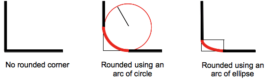
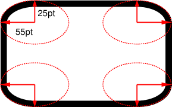
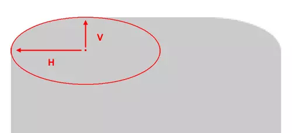

Các bạn đọc tựa xong sẽ nghĩ: "ơ ông này vớ vẩn, border-radius để bo góc mấy cái div chứ làm gì?"

Hmmm nhưng bạn đã bao giờ tự hỏi, cái giá trị `18px` hay `50%` được pass vào `border-radius` nghĩa là gì?

Thực chất `border-radius` là một shorthand property cho 4 CSS properties khác. Nên khi viết:

```css
border-radius: 18px;
```

Bạn đang viết tắt cho:

```css
border-top-left-radius: 18px;
border-top-right-radius: 18px;
border-bottom-left-radius: 18px;
border-bottom-right-radius: 18px;
```

4 properties này đại diện cho 4 góc của 1 element box (top left, top right, bottom left và bottom right), và browser dùng cái value bạn đưa vào để vẽ 1 đường con kết nối 2 cạnh của góc cần bo. Làm thế nào á? Câu trả lời nằm trong cái tên radius.

Radius là bán kính hình tròn. Khi vẽ cái đường cong này, browser sẽ dùng cái bán kính đó để tính ra toạ độ của tâm hình tròn:

```
x_circle = x_div_corner + border_radius (or -border_radius if it's the right edge)
y_circle = y_div_corner + border_radius (or -border_radius if it's the bottom edge)
```

Sau đó vẽ đường cong dùng cái toạ độ trên, và thêm vài thứ linh tinh như tuỳ vào góc là góc bên phải hay bên trái, trên hay dưới để vẽ cái đường cong theo chiều đồng hồ hoặc ngược etc (xem hình minh hoạ).

Đó là lý do khi `border-radius` là `50%` và element box của bạn có width và height bằng nhau (tạo ra hình vuông) thì browser sẽ xác định tâm hình tròn ở giữa vị trí 50% width và 50% height tức là ở giữa hình vuông và kẻ 4 đường cong cho 4 góc tạo thành hình tròn.

Tuy nhiên `border-radius` không chấp nhận giá trị < 0 nên bạn không thể dùng số âm để bo góc ngược vô trong :laughing:

Thế nhưng `border-radius` thực chất có thể chấp nhận tới 2 giá trị:

```css
border-top-left-radius: 10px 20px;
```

Đây là vì radius không hẳn là bán kính của hình tròn mà là hình ellipse nên bạn có thể dùng 2 giá trị radius cho chiều thẳng và chiều ngang khác nhau (xem hình minh hoạ)

**Hình minh hoạ:**





**Đọc thêm:**

- `border-radius` spec:  https://drafts.csswg.org/css-backgrounds/#border-radius
- `border-radius` on CSS almanac: https://css-tricks.com/almanac/properties/b/border-radius/
- Forward slash in `border-radius`: https://www.sitepoint.com/setting-css3-border-radius-with-slash-syntax/
