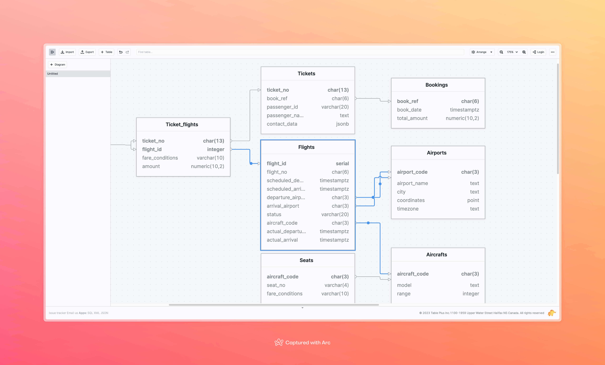
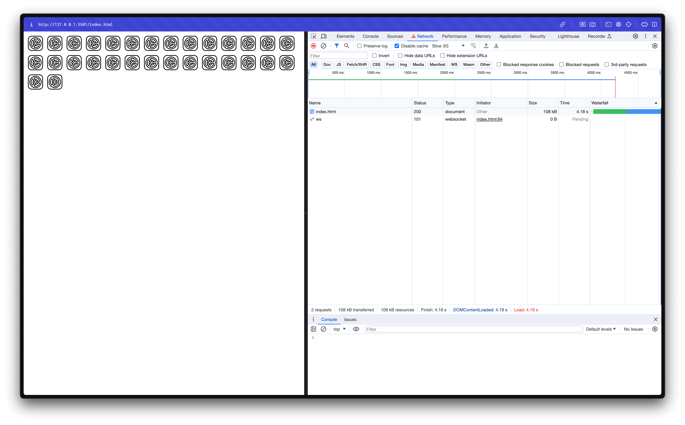
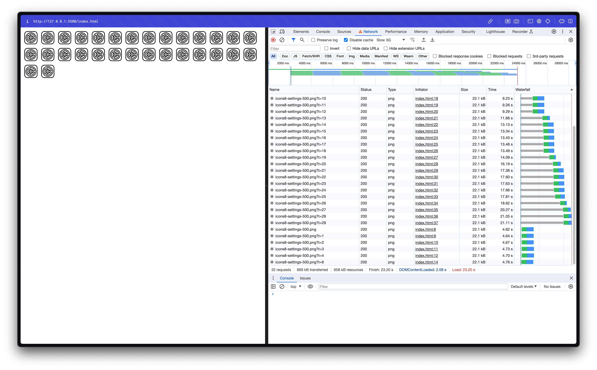
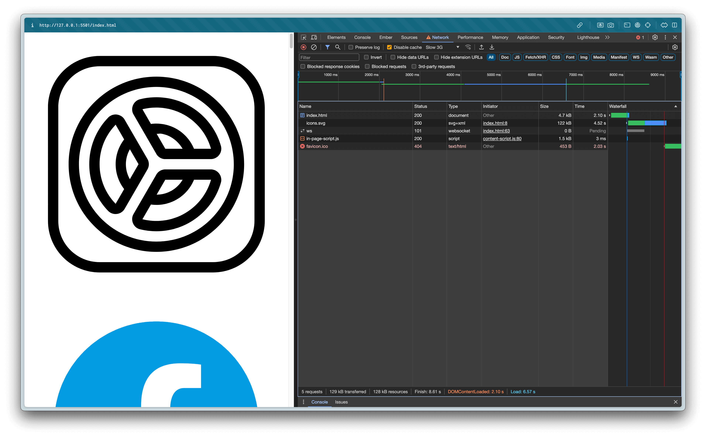

> Bài viết nãy sẽ khá là dài và có những đoạn code demo nên mình đã dựng nó lên 1 trang web để cho mọi người dễ tương tác hơn. Mọi người có thể xem [tại đây](https://xuanvan-dev.vercel.app/)

Một ngày đẹp trời, mình thấy trang [DiagramPlus](https://diagramplus.com/). Mình thắc mắc là làm sao có thể làm những cái line cùng với những animation khi focus vào 1 cái table như vậy.



Lúc đó inspect lên thì thấy là dùng SVG. Mở code lên thì đúng là khó khăn vì đọc mấy cái số trong mấy cái element thì chả hiểu gì cả. Cộng với nhiều khi làm việc với svg thì mình cũng chủ yếu sửa mấy cái đơn giản về style thôi chứ cụ thể nó vẽ như nào mình cũng không biết. Vì thế nên mình quyết tâm tìm hiểu xem SVG là cái gì và làm sao để có thể dùng nó.

### Vậy rốt cuộc, SVG là gì?

SVG là viết tắt của **Scalable Vector Graphics**. SVG định nghĩa [vector-based graphics](https://en.wikipedia.org/wiki/Vector_graphics) bằng định dạng XML.

Có 1 điều đặc biệt ở SVG đó là hình ảnh từ SVG sẽ không bị mất chất lượng khi zoom in. Khác với [Raster graphics](https://en.wikipedia.org/wiki/Raster_graphics) như PNG, JPEG... Thì hình ảnh sẽ được lưu dưới dạng ma trận hay 1 lưới điểm ảnh. Khi zoom in thì các điểm ảnh sẽ được phóng to lên và khiến cho giảm chất lượng hình ảnh. SVG sử dụng các công thức toán học để vẽ nên là hình ảnh sẽ không bị mất chất lượng khi zoom in.

### SVG có những lợi gì?

- Khi bạn muốn hiển thị logo, icon mà muốn chất lượng hình ảnh tốt nhất
- Chỉnh sửa dễ dàng, khi bạn muốn custom các animation và style của những hình ảnh, nếu hiểu về SVG bạn có thể dễ dàng custom được theo ý muốn của mình.
- Khi bạn muốn user có thể thao tác với hình ảnh. Tương tự như khi user click vào các line thì có thể thay đổi animation và style của hình ảnh.
- Nếu bạn viết SVG vào HTML thì sẽ giúp tăng tốc độ load trang lên. Vì file SVG thường sẽ có dung lượng nhỏ hơn, cộng với nếu viết bên trong file html thì sẽ không cần phải tải qua tầng network. Lúc đó thì các hình ảnh của bạn không cần phải đợi để load
- Bạn có thể dễ dàng tương tác với 1 file SVG bằng javascript. Ví dụ như bạn muốn thay đổi style của 1 hình ảnh khi user click vào thì bạn có thể dễ dàng làm được điều đó vì SVG là 1 phần của DOM. Sử lý sự kiện với SVG cũng tương tự như với HTML. Khác với canvas thì bạn sẽ cần phải tính toán để xác định được vị trí của object mà mình muốn tương tác.

Mình đã thử viết 1 file html sử dụng 30 icon sử dụng file png. Và 1 file html sử dụng 30 icon SVG nhưng inline. Thì khi load lên thì tốc độ tải khác hẳn.





Đương nhiên rằng việc viết SVG vào HTML sẽ không phải là tốt nhất. Vì nếu bạn viết SVG vào HTML thì sẽ không thể cache và reuse được. Có 1 cách đó là `SVG sprites`. nó sẽ giúp bạn có thể cache và reuse được SVG. Nhưng nó cũng có nhược điểm là nếu bạn muốn thay đổi style của SVG thì sẽ phải thay đổi trong file CSS.

Để implement được `SVG sprites` bạn có thể xem tại [đây](https://medium.com/@hayavuk/complete-guide-to-svg-sprites-7e202e215d34).

```
<?xml version="1.0" encoding="utf-8"?>
  <svg xmlns="http://www.w3.org/2000/svg">
    <defs>
      <symbol id="setting" viewBox="0 0 50 50" >
      ....
      </symbol>
      <symbol id="phone" viewBox="0 0 50 50" >
      ....
      </symbol>
    </defs>
</svg>
```

Định nghĩa tất cả các hình ảnh trong file svg. Kèm theo mỗi symbold là 1 id cho mỗi hình. Sau đó bạn có thể sử dụng các hình ảnh đó bằng cách sử dụng `use` element. Nếu ví dụ bạn muốn sử dụng hình ảnh `setting` thì sẽ là như sau

```
<svg class="icon" viewBox="0 0 50 50">
  <use href="./icons.svg#setting" />
</svg>
```



Sau khi sử dụng `SVG sprites` thì bạn đã có thể load được toàn bộ các icon lên trong 1 file và có thể dùng net work cache để cache lại các icon đó.

### SVG có những shape cơ bản nào?

#### 1\. Rectangle

Hình chữ nhật được định nghĩa bằng element `rect`

<rect x="0" y="0" width="50" height="50" rx="5" ry="5" fill="#ffab73" />

Trong đó `x`, `y` là toạ độ của hình chữ nhật. `width`, `height` là kích thước của hình chữ nhật.`rx`, `ry` là border-radius của hình chữ nhật.

#### 2\. Circle

Hình tròn được định nghĩa bằng element `circle`

<circle cx="25" cy="25" r="25" fill="#ffab73" />

Trong đó `cx`, `cx` là toạ độ tâm của hình tròn. `rx` là bán kính hình tròn

#### 3\. Ellipse

Hình Ellip được định nghĩa bằng element `ellipse`

<ellipse cx="100" cy="50" rx="100" ry="50" fill="#ffab73" />

Trong đó `cx`, `cx` là toạ độ tâm của hình ellip. `rx`, `ry` là bán kính ngang dọc của hình ellip.

#### 4\. Line

Một đường thẳng được định nghĩa bằng element `line`

<line x1="5" y1="5" x2="99" y2="99" stroke="#ffab73" stroke-width="3"/>

Trong đó `x1`, `y1` và `x2`, `y2` là 2 điểm của đường thẳng.

#### 5\. Polyline

`polyline` định nghĩa 1 tập các đoạn thẳng kết nối với nhau

```
<polyline
  points="0,0 40,0 40,40 80,40 80,0 120,0 120,40 160,40 160,0 200,0 200,40"
  stroke="#ffab73"
  fill="none"/>
```

Trong đó `points` là tập hợp các điểm đầu và điểm cuối của đoạn thẳng

#### 6\. polygon

`polygon` định nghĩa 1 tập các đoạn thẳng kết nối với nhau

```
<polygon
  points="0,0 40,0 40,40 80,40 80,0 120,0 120,40 160,40 160,0 200,0 200,40 0 40"
  fill="#ffab73"
  stroke="#ffab73"
/>
```

Trong đó `points` là tập hợp các điểm đầu và điểm cuối của đoạn thẳng. Điểm cuối của đoạn thẳng cuối cùng sẽ được tự động nối với điểm đầu của đoạn thẳng đầu tiên tạo nên 1 hình khép kín

### Vậy làm sao để vẽ được đường cong?

Thường thì để vẽ ra đường các đường cong phức tạp thì sẽ dùng các tool online để tạo ra thay vì code chay. Nhưng để hiểu được nó là cái gì thì ở đây mình sẽ giải thích cách để dùng nó.

_**Điểm tuyệt đối** là được xác định toạ độ vị trí chính xác sẽ vẽ tới._  
_**Điểm tương đối** là được xác định bằng cách cộng toạ độ vị trí của điểm hiện tại với giá trị được cung cấp._

Sử dụng element `path` để vẽ ra các đường cong. Với thuộc tính `d` bên trong `path` dùng để diễn tả shape trong path bao gồm các lệnh _moveto, line, curve, arc_ và _closepath_

#### moveto

Lệnh _moveto_ bắt đầu bằng `M` hoặc `m` dùng để di chuyển tới 1 điểm xác định.  
`M` dùng để di chuyển tới 1 điểm tuyệt đối. `m` dùng để di chuyển tới 1 điểm tương đối.

#### closepath

Lệnh _closepath_ dùng để vẽ 1 đường thẳng kết nối từ điểm cuối cùng và điểm đầu tiên của path. Điều đặc biệt là khác với lệnh moveto thì dùng `z` hay `Z` đều được.

#### line

Lệnh _line_ dùng để vẽ 1 đường thẳng kết nối 2 điểm, từ điểm hiện tại cho đến 1 điểm xác định.

**L / l**

<path d="M0 0 L50 50 l100 0" stroke="black" stroke-width="10" fill="none" />

Bắt đầu bằng `L` dùng để vẽ 1 đường thẳng tới 1 điểm tuyêt đối..  
Bắt đầu bằng `l` dùng để vẽ 1 đường thẳng tới 1 điểm tương đối so với điểm hiện tại

**H / h, V / v**

<path d="M0 0 L50 50 H 100 V 100 h 50 v 50" stroke="black" stroke-width="10" fill="none" />

Bắt đầu bằng `H` dùng để vẽ 1 đường ngang tới 1 điểm tuyệt đối với toạ độ `x` được cung cấp  
Bắt đầu bằng `h` dùng để vẽ 1 đường ngang tới 1 điểm tương đối với điểm hiện tại. `x = currentX + dx`  
Bắt đầu bằng `V` dùng để vẽ 1 đường dọc tới 1 điểm tuyệt đối với toạ độ `y` được cung cấp  
Bắt đầu bằng `v` dùng để vẽ 1 đường dọc tới 1 điểm tương đối với điểm hiện tại `y = currentY + dy`

### curve

Có 3 nhóm lệnh trong _curve_ được sử dụng để vẽ các đường cong. Bao gồm _Cubic Bézier (C, c, S, s), Quadratic Bézier (Q, q, T, t), and Elliptical arc (A, a)._.

#### Đầu tiên phải tìm hiểu xem Cubic Bézier là gì

Cubic Bézier là [Bézier Curve](https://en.wikipedia.org/wiki/B%C3%A9zier_curve) bậc ba

Cubic Bézier là một đường cong được định nghĩa bằng các điểm: điểm bắt đầu, điểm kết thúc và 2 điểm điều khiển.

Vậy thì chính xác nó được máy tính vẽ như thế nào?

Tưởng tượng quá trình vẽ sẽ bắt đầu từ 0% tới 100%. Bắt đầu bằng các điểm P0, P1, P2, có các điểm Q0, Q1, Q2 bắt đầu chạy từ điểm xuất phát tương ứng. Ứng với từng thời điểm chúng ta sẽ xác định điểm T1 và T2 là các điểm tương ứng với số % hiện tại. Sau đó tiếp tục nối 2 điểm T1 và T2 lại với nhau. Chúng ta lấy điểm X với là toạ độ của điểm cần vẽ, với toạ độ X là toạ độ dựa trên giá trị % của quá trình vẽ hiện tại dựa trên đường thằng T1 T2. Hình bên trên là mô tả lúc quá trình vẽ đang ở 50% và cách xác định điểm X. Đường Cubic Bézier là tập hợp các điểm X trong suốt quá trình vẽ


Mô phỏng quá trình vẽ của Cubic Bézier

```
<path d="M100 200 C150.0 70.0, 350.0 30.0, 450 200" />
```

_Bạn có thể kéo thử các điểm điều khiển để thấy được sự thay đổi của đường cong._

Đường cong Cubic Bézier trong SVG được vẽ bằng lệnh `C / c`. **C** để xác định các toạ độ tuyệt đối và **c** để xác định điểm có giá trị được tính bằng điểm hiện tại cộng với `dx / dy`

_Ngoài ra bạn có thể thấy Cubic Bézier ở các thuộc tính `transition-timing-function` của css. Bạn có thể đọc thêm tại [transition timing function](https://developer.mozilla.org/en-US/docs/Web/CSS/transition-timing-function) và [easing function](https://developer.mozilla.org/en-US/docs/Web/CSS/easing-function)_

Để vẽ được những đường cong Cubic Bézier mượt mà từ điểm kết thúc của đường cong phía trước. Chúng ta có thể sử dụng lệnh `S/s` để vẽ tiếp đường cong. Lệnh này sẽ tự động xác định điểm điều khiển thứ 1 dựa trên điểm điều khiển thứ 2 của đường cong phía trước. Lệnh `S/s` sẽ nhận vào 2 điểm là điểm điều khiển thứ 2 và điểm kết thúc

<svg viewBox="0 0 600 400" xmlns="http://www.w3.org/2000/svg" overflow="visible" style="max-width:600px;width: 100%;">
   <path d="M10 200 L150 70" fill="none" stroke="#000000" stroke-width="2"></path>
   <path d="M250 30 L350 200" fill="none" stroke="#000000" stroke-width="2"></path>
   <path d="M450 30 L550 200" fill="none" stroke="#000000" stroke-width="2"></path>
   <path d="M350 200 L450 370" fill="none" stroke="#000000" stroke-width="2" stroke-dasharray="10"></path>
   <path d="M10 200 C 150 70, 250 30, 350 200 S450 30, 550 200" fill="none" stroke="#ffab73" stroke-width="5"></path>
   <circle cx="10" cy="200" r="5" stroke="blue" stroke-width="2" fill="blue"></circle>
   <circle cx="150" cy="70" r="5" stroke="green" stroke-width="2" fill="green"></circle>
   <circle cx="250" cy="30" r="5" stroke="red" stroke-width="2" fill="red"></circle>
   <circle cx="350" cy="200" r="5" stroke="purple" stroke-width="2" fill="purple"></circle>
   <circle cx="450" cy="30" r="5" stroke="brown" stroke-width="2" fill="brown"></circle>
   <circle cx="450" cy="370" r="5" stroke="cyan" stroke-width="2" fill="cyan"></circle>
   <circle cx="550" cy="200" r="5" stroke="#db2777" stroke-width="2" fill="#db2777"></circle>
</svg>

```
<path d="M10 200 C150.0 70.0, 250.0 30.0, 550.0 200.0 S450.0 30.0, 550 200" />
```

_Bạn có thể kéo thử các điểm điều khiển để thấy được sự thay đổi của đường cong._

#### Quadratic Bézier

Quadratic Bézier là [Bézier Curve](https://en.wikipedia.org/wiki/B%C3%A9zier_curve) bậc hai

Quadratic Bézier là đường cong mà chỉ có 1 điểm kiểm soát. Nó yêu cầu một điểm kiểm soát xác định độ dốc của đường cong ở cả điểm bắt đầu và điểm kết thúc. Nó có hai tham số: điểm kiểm soát và điểm cuối của đường cong.

```
Q x1 y1, x y
(or)
q dx1 dy1, dx dy
```

Tương tự với Cubic Bézier, chúng ta có thể dùng lệnh `T` để vẽ tiếp 1 đường cong dựa theo đường cong phía trước. Lệnh này sẽ tự động xác định điểm kiểm soát dựa trên điểm kiểm soát của đường cong phía trước. Nó chỉ có 1 tham số là điểm kết thúc của đường cong. Và chỉ duy nhất dùng được nếu phía trước là lệnh Q hoặc T

```
T x y
(or)
t dx dy
```

<svg style="max-width:600px;width: 100%;"
  xmlns="http://www.w3.org/2000/svg" viewBox="0 0  200 160">
<path d="M 10 80 L 52.5 10" stroke="black" stroke-width="0.5" stroke-dasharray="3" fill="transparent"></path>
<path d="M 95 80 L 52.5 10" stroke="black" stroke-width="0.5" stroke-dasharray="3" fill="transparent"></path>
<path d="M 95 80 L 137.5 150" stroke="black" stroke-width="0.5" stroke-dasharray="3" fill="transparent"></path>
<path d="M 180 80 L 137.5 150" stroke="black" stroke-width="0.5" stroke-dasharray="3" fill="transparent"></path>
<path d="M 10 80 Q 52.5 10, 95 80 T 180 80" stroke="#ffab73" fill="transparent"></path>
<circle cx="10" cy="80" r="2" fill="blue"></circle>
<circle cx="52.5" cy="10" r="2" fill="green"></circle>
<circle cx="95" cy="80" r="2" fill="red"></circle>
<circle cx="180" cy="80" r="2" fill="purple"></circle>
<circle cx="137.5" cy="150" r="2" fill="red"></circle>
ƒ
</svg>

```
<path
   d="M 10 80 Q 52.5 10, 95 80 T 180 80"
   stroke="green"
   fill="transparent"
 />
```

### Arc

Lệnh A dùng để vẽ một đường vong cung với cú pháp là

```
A rx ry x-axis-rotation large-arc-flag sweep-flag x y
```

Trong đó:

- Điểm bắt đầu vòng cung sẽ là điểm hiện tại
- `rx` và `ry` là bán trục lớn và bán trục nhỏ của đường cung.
- `x-axis-rotation` là góc xoay của trục x của hình ellipse so với trục x của user space.
- `large-arc-flag` và `sweep-flag` là các giá trị boolean quyết định hình dạng của cung.
- `x` và `y` là tọa độ điểm cuối của đoạn cung.


Với 2 thông số `large-arc-flag` và `sweep-flag` có thể xác định được 4 cung tròn khác nhau.

- `large-arc-flag`Nếu giá trị là `1` thì sẽ chọn 1 trong 2 vòng cung lớn hơn hoặc bằng 180 độ. Nếu giá trị là `0` thì sẽ chọn 1 trong 2 vòn cung nhỏ hơn 180 độ.
- `sweep-flag` Nếu giá trị là `1` thì sẽ chọn 1 trong 2 vòng cung có góc số dương. Nếu giá trị là `0` thì sẽ chọn 1 trong 2 vòn cung có góc số âm

<svg xmlns="http://www.w3.org/2000/svg" viewBox="0 0 520 420"
   class="max-w-[520px] w-full">
<path d="M 80 80
      A 45 45, 0, 0, 0, 125 125
      " fill="none" stroke-width="3" stroke="green"></path>
<path d="M 230 80
      A 45 45, 0, 1, 0, 275 125
      " fill="none" stroke-width="3" stroke="red"></path>
<path d="M 80 230
      A 45 45, 0, 0, 1, 125 275
      " fill="none" stroke-width="3" stroke="purple"></path>
<path d="M 230 230
      A 45 45, 0, 1, 1, 275 275
      " fill="none" stroke-width="3" stroke="blue"></path>
</svg>

### Animation trong SVG

Để làm được animation trong SVG thì chúng ta sẽ sử dụng element `animate`, element `animateMotion` và `animateTransform` để tạo ra các animation

- `animate` dùng để thay đổi giá trị của 1 thuộc tính của 1 element. Ví dụ như có tể thay đổi giá trị fill của 1 element từ màu đỏ sang xanh

```
<animate
  attributeName="fill"
  values="red;green;red"
  dur="4s"
  repeatCount="indefinite"
/>
```

<svg viewBox="0 0 20 10" xmlns="http://www.w3.org/2000/svg" width="200">
   <rect width="20" height="10" rx="1">
      <animate attributeName="fill" values="red;green;red" dur="4s" repeatCount="indefinite"></animate>
   </rect>
</svg>

- `animateMotion` dùng để thay đổi vị trí của 1 element. Cung cấp cho nó 1 path để nó có thể di chuyển theo path đó

```
<animateMotion
  path="M 0 0 L 40 0 z"
  dur="4s"
  repeatCount="indefinite"
/>
```

<svg viewBox="0 0 60 20" xmlns="http://www.w3.org/2000/svg" width="200">
   <rect width="20" height="20">
      <animateMotion path="M 0 0 L 40 0 z" dur="4s" repeatCount="indefinite"></animateMotion>
   </rect>
</svg>

- `animateTransform` dùng để thay đổi các thuộc tính transform của 1 element. Bao gồm như translation, scaling, rotation, and/or skewing.

```
<animateTransform
  attributeName="transform"
  attributeType="XML"
  type="rotate"
  from="0 30 30"
  to="360 30 30"
  dur="1s"
  repeatCount="indefinite"
/>
```

<svg viewBox="0 0 60 60" xmlns="http://www.w3.org/2000/svg" width="200">
   <rect x="20" y="20" width="20" height="20">
      <animate attributeName="rx" values="10;0;10" dur="4s" repeatCount="indefinite"></animate>
      <animate attributeName="fill" values="blue;green;yellow;red;blue;pink;purple" dur="4s" repeatCount="indefinite"></animate>
      <animateTransform attributeName="transform" attributeType="XML" type="rotate" from="0 30 30" to="360 30 30" dur="1s" repeatCount="indefinite"></animateTransform>
   </rect>
</svg>

### Cùng nhau vẽ thử Line Chart dùng SVG

<svg xmlns="http://www.w3.org/2000/svg"
  style="max-width:520px; width: 100%;"
  viewBox="0 0 180 110" overflow="visible">
<path d="M 0 90L10 80L20 85L30 65L40 50L50 30L60 80L70 60L80 50L90 0L100 50L110 70L120 30L130 50L140 40L150 70L160 20L170 15" stroke="#ffab73" fill="none" stroke-width="0.5" stroke-dasharray="471" stroke-dashoffset="471">
<animate attributeName="stroke-dashoffset" to="0" dur="3s" fill="freeze"></animate>
</path>
<path d="M0 0 L0 100 L 180 100" stroke="black" stroke-width="1" fill="none" stroke-linejoin="miter"></path>
<circle cx="0" cy="90" r="0.5" stroke="red" stroke-width="2" fill="red"></circle>
<circle cx="10" cy="80" r="0.5" stroke="red" stroke-width="2" fill="red"></circle>
<circle cx="20" cy="85" r="0.5" stroke="red" stroke-width="2" fill="red"></circle>
<circle cx="30" cy="65" r="0.5" stroke="red" stroke-width="2" fill="red"></circle>
<circle cx="40" cy="50" r="0.5" stroke="red" stroke-width="2" fill="red"></circle>
<circle cx="50" cy="30" r="0.5" stroke="red" stroke-width="2" fill="red"></circle>
<circle cx="60" cy="80" r="0.5" stroke="red" stroke-width="2" fill="red"></circle>
<circle cx="70" cy="60" r="0.5" stroke="red" stroke-width="2" fill="red"></circle>
<circle cx="80" cy="50" r="0.5" stroke="red" stroke-width="2" fill="red"></circle>
<circle cx="90" cy="0" r="0.5" stroke="red" stroke-width="2" fill="red"></circle>
<circle cx="100" cy="50" r="0.5" stroke="red" stroke-width="2" fill="red"></circle>
<circle cx="110" cy="70" r="0.5" stroke="red" stroke-width="2" fill="red"></circle>
<circle cx="120" cy="30" r="0.5" stroke="red" stroke-width="2" fill="red"></circle>
<circle cx="130" cy="50" r="0.5" stroke="red" stroke-width="2" fill="red"></circle>
<circle cx="140" cy="40" r="0.5" stroke="red" stroke-width="2" fill="red"></circle>
<circle cx="150" cy="70" r="0.5" stroke="red" stroke-width="2" fill="red"></circle>
<circle cx="160" cy="20" r="0.5" stroke="red" stroke-width="2" fill="red"></circle>
<circle cx="170" cy="15" r="0.5" stroke="red" stroke-width="2" fill="red"></circle>
</svg>

Để vẽ được animation như trên thì dùng `stroke-darkarray` và `stroke-darkoffset` để tạo ra animation

- `stroke-darkarray` dùng để tạo nên đường thẳng có nét đứt. Ví dụ như `stroke-darkarray="5"` thì sẽ tạo ra 1 đường thẳng có 5 đoạn thẳng và 5 đoạn trống
- `stroke-darkoffset` dùng để xác định vị trí bắt đầu của 1 đường thẳng có nét đứt dựa trên `stroke-darkarray`

Thử thay đổi giá trị của `stroke-darkarray` và `stroke-darkoffset` để xem sự thay đổi của đường thẳng

strokeDasharray: 600

strokeDashoffset: 600

Nếu bạn để ý thì nếu để `stroke-darkarray` là 600. Rồi giảm `stroke-darkoffset` từ 600 về 0 thì sẽ thấy đường thẳng như đang chạy từ điểm bắt đầu về điểm kết thúc. Vậy để làm animation thì chúng ta chỉ cần cho giá trị của `stroke-darkoffset` chạy về 0 là được. Nhưng mà làm sao để biết chính xác được giá trị của `stroke-darkoffset` là bao nhiêu?. Giá trị của `stroke-darkoffset` sẽ là bằng độ dài của path và chúng ta có thể dùng hàm [getTotalLength](https://developer.mozilla.org/en-US/docs/Web/API/SVGGeometryElement/getTotalLength) của Javascript để lấy giá trị. Sau đó chúng ta có thể viết 1 đoạn animate trong path là được rồi.

```
<animate
  attributeName="stroke-dashoffset"
  to="0"
  dur="3s"
  fill="freeze"
  />
```

`fill="freeze"` dùng để giữ giá trị của thuộc tính sau khi animation kết thúc. Nếu không có thì giá trị của thuộc tính sẽ trở về giá trị ban đầu.

### Text trong SVG

Để viết text trong SVG thì ta dùng element `text`. Nếu muốn text có thể wrap text thì dùng element `tspan` bên trong element `text`.

```
<svg viewBox="0 0 200 50" xmlns="http://www.w3.org/2000/svg">
  <text x="1" y="30" class="text-xs">
    Hello
    <tspan fill="#ffab73"> World </tspan>!
  </text>
</svg>
```

<svg viewBox="0 0 200 50" xmlns="http://www.w3.org/2000/svg">
  <text x="1" y="30" class="text-xs">
    Hello
    <tspan fill="#ffab73"> World </tspan>!
  </text>
</svg>

Hoặc là nếu bạn muốn text uốn cong theo 1 đường cong nào đó thì dùng element `textPath` bên trong element `text`. Chỉ cần vẽ ra path rồi dùng textPath trỏ tới dựa theo id của path. Nếu muốn ẩn path đi thì bỏ vào trong 1 element `defs` là được

```

<svg style="max-width:600px;width: 100%;" xmlns="http://www.w3.org/2000/svg" viewBox="0 0  200 160">
   <defs>
      <path d="M 10 80 Q 52.5 10, 95 80 T 180 80" stroke="#ffab73" fill="transparent" id="path"></path>
   </defs>
   <text class="text-xs">
      <textPath href="#path">Quick brown fox jumps over the lazy dog.</textPath>
   </text>
</svg>

```

<svg style="max-width:600px;width: 100%;" xmlns="http://www.w3.org/2000/svg" viewBox="0 0  200 160">
   <defs>
      <path d="M 10 80 Q 52.5 10, 95 80 T 180 80" stroke="#ffab73" fill="transparent" id="path"></path>
   </defs>
   <text class="text-xs">
      <textPath href="#path">Quick brown fox jumps over the lazy dog.</textPath>
   </text>
</svg>

### Tổng kết

Nhìn chung thì việc tự code 1 cái svg hoàn toàn thì rất là phức tạp để làm. Nhưng mà việc biết qua cơ bản về các shape và 1 vài thuộc tính của nó cũng có thể giúp mình dễ dàng thay đổi hoặc giúp đỡ trong công việc làm Front-end. Bài viết này như một cách để mình note lại những gì mà mình học được trong cả quá trình tìm hiểu về SVG. Nếu có sai sót gì thì mọi người cứ góp ý cho mình nhé.

<svg viewBox="0 0 200 300" fill="none" overflow="visible" style="max-width:100px;width: 100%;" xmlns="http://www.w3.org/2000/svg">
   <path d="M100 300V270" stroke="#25625b" stroke-width="20"></path>
   <path d="M200 270H0 L 100 170 L 200 270 z" stroke="#25625b" fill="#25625b" stroke-width="3" stroke-linecap="round"></path>
   <path d="M190 210H10 L 100 110 L 190 210 z" stroke="#25625b" stroke-width="3" fill="#25625b"></path>
   <path d="M180 150H20 L 100 50 L 180 150 z" stroke="#25625b" stroke-width="3" fill="#25625b"></path>
   <path d="M 100 10 L 120 60 L70 27 L 130 27 L 80 60 z" fill="#25625b" stroke="#25625b"></path>
</svg>

_Vì bài viết này được chia sẻ vào ngày 24/12 nên mình xin chúc mọi người một mùa Giáng sinh an lành và một năm mới hạnh phúc._

### Tham khảo

- [MDN SVG](https://developer.mozilla.org/en-US/docs/Web/SVG)
- [Pocket Guide to Writing SVG](https://svgpocketguide.com/)
