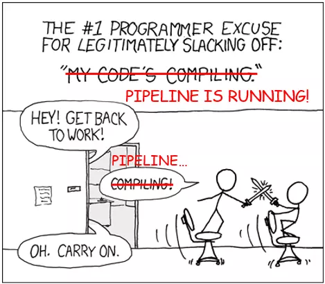
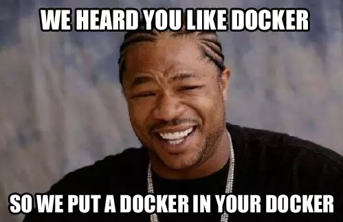
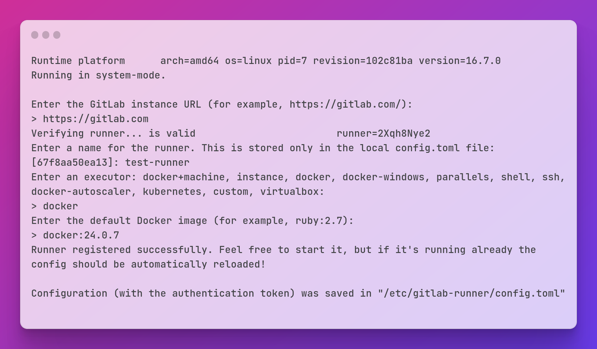
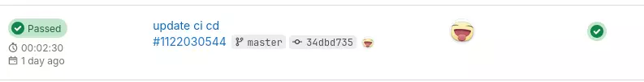
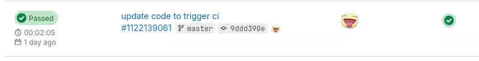
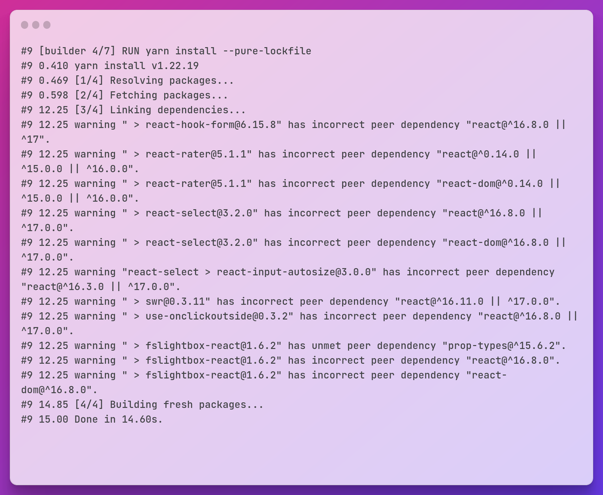
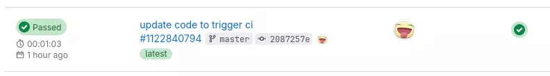
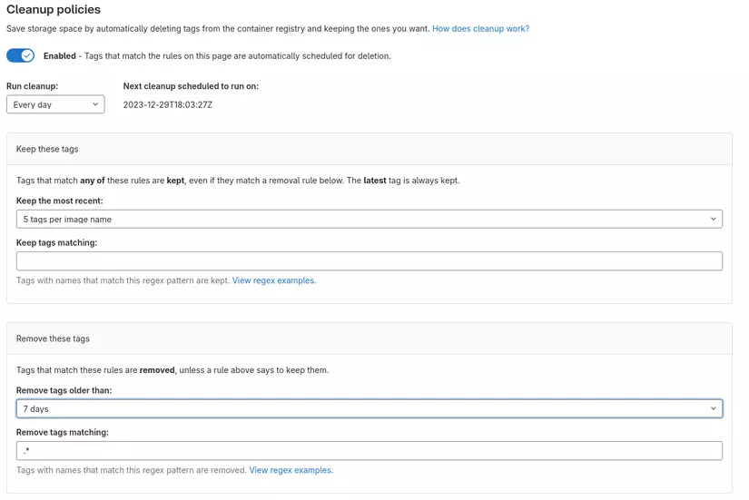

# GitlabCI và tuyệt thế võ học tối ưu pipeline

Những tuyệt kỹ võ công cái thế với chiếc gậy của lão ăn mày - GitlabCI.

## First things first

- Em đang gặp vấn đề với GitlabCI vì build docker khá chậm, làm sao để tăng tốc nó lên anh?
- Mỗi lần code xong là em phải chờ 10-15 phút mới lên được môi trường dev, thay có mỗi cái ảnh thôi cũng build lại cả project!
- Sao chạy build bằng GitlabCI mà thời gian lại lâu gấp đôi build bằng Jenkin thế ạ?



Đây là những câu hỏi, những câu cảm thán trên không ít các diễn đàn, hội nhóm công nghệ. Người than thở thì cũng trải rộng từ Dev, System, DevOps,... chứ không phải ít. Điều này chứng tỏ mặc dù GitlabCI từ lâu đã trở thành tool CI "quốc dân" được đông đảo tầng lớp IT sử dụng, thế nhưng vẫn có rất nhiều người loay hoay không biết làm thế nào để sử dụng GitlabCI cho hợp lý và quan trọng hơn là cho nó nhanh.

Nắm bắt được nhu cầu đó, tại hạ - **Minh Monmen** - thân là chân le ve trà nước đụng gì làm đó trong Cái Bang thôi nhưng được cái dùng GitlabCI cũng ngót nghét 8 mùa bánh chưng nên nay lãnh trọng trách biên soạn cuốn bí kíp tuyệt thế võ công xung quanh chiếc **Đả Cẩu Bổng** quen thuộc này.

Vốn lâu nay tại hạ mai danh ẩn tích trên giang hồ, chỉ sinh hoạt ở vài hội kín chuyên chat chit trong giờ hành chính như webu, DevOps VN,... Thế nhưng thấy thế sự nguy cấp, dân chúng lầm than, tại hạ lòng đau như cắt, nước mắt đầm đìa, chỉ căm tức chưa xả... í lộn bài, chỉ hận không thể lập tức cứu khốn phò nguy, trấn an bá tánh mà chỉ có thể ngồi đây soạn ra cuốn tuyệt thế võ học này. Thôi thì kính mong chư vị huynh đài có đi qua đây thả cho 1 upvote và vài lời bình phẩm (comment) để bí kíp cái bang này hoàn thiện hơn.

Bí kíp này sẽ tập trung vào những vấn đề xung quanh 1 môn võ duy nhất: **Build docker image với GitlabCI**.

## Cấp độ 1: Setup self-hosted GitlabCI runner để build được docker

Để đọc được phần này thì tại hạ sẽ ngầm hiểu quý vị độc giả đã **biết GitlabCI là cái gì**, **đã dùng thử GitlabCI** và **hiểu được self-hosted runner** nghĩa là gì rồi. Và cũng ngầm hiểu luôn là quý vị đã đọc kỹ hướng dẫn này của gitlab về những phương pháp setup runner để build được docker image: [https://docs.gitlab.com/ee/ci/docker/using_docker_build.html](https://docs.gitlab.com/ee/ci/docker/using_docker_build.html).

Đại khái thì để chạy được lệnh build của docker thì chúng ta cần 1 cái **docker daemon** được chạy ở đâu đó và Gitlab đã nói rất rõ về 3 phương pháp chính dùng để build docker trong job là:

- Sử dụng **shell executor**: Dùng **shell của host** do đó sẽ có quyền truy cập đến **docker daemon của host**.
- Sử dụng **Docker-in-Docker**: **Chạy script trong container** bằng docker / kubernetes executor và **sử dụng docker daemon của 1 container đặc biệt** chạy kèm là **docker-in-docker** (dind)
- **Mount docker socket** vào container: Đây là kiểu lai giữa 2 thằng trên, **chạy script trong container** bằng docker executor nhưng lại sử dụng **docker daemon của host** thông qua việc mount cái `/var/run/docker.sock`.

> *Còn 2 phương pháp ngoài lề nữa là dùng những thằng không phải docker để build image như là kaniko hay là buildah thì tại hạ sẽ không đề cập ở đây vì đơn giản là tại hạ xài thử lâu rồi và nó chậm quá, không phù hợp cho 1 bài về tối ưu tốc độ như này.* 

Mỗi phương pháp thì đều có điểm lợi hại riêng. Không có phương pháp nào là chuẩn chỉ mà việc lựa chọn 1 trong 3 phương pháp này dựa trên requirement của từng hệ thống và tradeoff mà thôi.

Ví dụ như với hệ thống nghèo khó của tại hạ chỉ có 1 con VPS nho nhỏ dùng để chạy runner thì tại hạ sẽ chọn cách thứ 3 (mount docker socket) vì:

- Cách dùng **shell executor** thì không khoái vì nó không isolate được môi trường chạy script của tại hạ (do chạy chung trên shell của host). Do đó nó phụ thuộc rất nhiều vào môi trường của host. Chẳng hạn như host chạy node ver nào blablo. Bỏ qua ngay và luôn.
- Dùng **Docker-in-Docker** thì tại hạ đã từng setup rất nhiều, cả trên VM cả trên các loại K8S managed như GKE, EKS hay K8S tự setup bằng kops. Suck! Cái vũng lầy về kết nối TLS nó quá là sâu, mất quá nhiều thời gian quý báu của tại hạ và team. Nhất là cái giai đoạn docker ở version loanh quanh 1.19 nó lỗi lên lỗi xuống, vài hôm lại lỗi tè le mà chả thay đổi gì cũng chả hiểu tại sao. Thêm cái là nó chạy storage trong docker nên cũng chậm đi so với 2 cách build còn lại kha khá. Thôi thì hệ thống là của anh em, nên anh em có thể cân nhắc xài cũng ok, các phương pháp trong cuốn bí kíp này vẫn có thể áp dụng bình thường.



Chọn phương pháp mount docker socket vì nó đơn giản, nó work out of the box và rất ít phải thay đổi file gitlab-ci config (như dind là thêm env rồi service tá lả). Tất nhiên nó có vấn đề về security với host, nhưng tầm quan trọng của cái vấn đề đó với tại hạ không quá to để lấn át khoảng thời gian tiết kiệm được nhờ sử dụng nó.

Ok, sau khi chúng ta đã có 1 con VPS có cài docker version mới nhất thì start gitlab runner với câu lệnh sau:

```bash
$ docker run -d --name gitlab-runner --restart always \
    -v /var/run/docker.sock:/var/run/docker.sock \
    -v /srv/gitlab-runner/config:/etc/gitlab-runner \
    gitlab/gitlab-runner:alpine
```

Sau đó chúng ta vô Gitlab, tạo mới 1 runner cho project hoặc cho group. Với flow cấp token mới của GitlabCI thì ta sẽ nhận được `authentication token` thay vì `registration token`. Do vậy sẽ cần chạy command sau để đăng ký runner:

```bash
$ export RUNNER_AUTH_TOKEN=<your_auth_token>
$ docker run --rm -it -v /srv/gitlab-runner/config:/etc/gitlab-runner gitlab/gitlab-runner:alpine register --token $RUNNER_AUTH_TOKEN
```



Xong. Runner của chúng ta đã được config và tự động chạy, các bạn có thể chạy `docker logs gitlab-runner` để thấy config đã được reload. Tuy nhiên config mặc định này chưa mount docker socket vô job cho chúng ta, do đó hãy sửa lại file config `/srv/gitlab-runner/config/config.toml` chút đỉnh:

```
concurrent = 1
check_interval = 0
shutdown_timeout = 0

[session_server]
  session_timeout = 1800

[[runners]]
  name = "test-runner"
  url = "https://gitlab.com"
  id = 1234567
  token = "<your_auth_token>"
  token_obtained_at = 2023-12-28T18:10:15Z
  token_expires_at = 0001-01-01T00:00:00Z
  executor = "docker"
  [runners.cache]
    MaxUploadedArchiveSize = 0
  [runners.docker]
    tls_verify = false
    image = "docker:24.0.7"
    privileged = false
    disable_entrypoint_overwrite = false
    oom_kill_disable = false
    disable_cache = false
    volumes = ["/var/run/docker.sock:/var/run/docker.sock", "/cache"]
    shm_size = 0
    network_mtu = 0
    pull_policy = "if-not-present"
```

> Tip trick: trong config này nếu để ý các bạn sẽ thấy ngoài thêm volume docker socket ra thì còn có thêm 1 cái config `pull_policy = "if-not-present"`. Config này dùng để hạn chế việc runner lần nào build cũng phải pull lại các image cơ bản như docker, dind hay node mà dùng luôn image với tag đó có sẵn trên host. Cái này **tiết kiệm được rất nhiều** thời gian và tiền bạc mỗi khi job chạy đấy nhé. Ngoài ra còn hạn chế việc bị Docker hub rate limit vì pull quá nhiều nữa.

> Tips 2: Sau khi edit config gitlab-runner sẽ tự reload lại chứ không cần restart thủ công đâu nhé.

Tới đây là xong, thử ngay và luôn với project `next-ecommerce` sử dụng nextjs clone từ bên github với `Dockerfile` simple sau:

```Dockerfile
FROM node:18

WORKDIR /app
EXPOSE 3000

COPY . .
RUN yarn install
RUN yarn build

CMD ["npm", "run", "start"]
```

```yaml
image: docker:24.0.7

stages:
  - build

variables:
  IMAGE_TAG: $CI_REGISTRY_IMAGE:$CI_COMMIT_SHORT_SHA

build:
  stage: build
  before_script:
    - docker login -u gitlab-ci-token -p $CI_JOB_TOKEN registry.gitlab.com
  script:
    - docker build -t $IMAGE_TAG .
    - docker push $IMAGE_TAG
```

Kết quả:



## Cấp độ 2: Tối ưu docker layer cache

Tất nhiên, app trên của chúng ta chỉ là 1 cái example app, nên thời gian install dependencies và build rất nhanh. Chạy lần đầu không cache củng gì mất có 2 phút rưỡi.

Tuy nhiên đến đây tổng thể luồng CI/CD sẽ xuất hiện các vấn đề chưa tối ưu:

- **Docker image nặng**
- **Thời gian mỗi lần build lại sẽ giống như lần đầu tiên** dù chúng ta thay đổi code ít hay nhiều (hay thậm chí không đổi gì)
- **Đánh tag docker image chưa tốt**: Mặc dù tag image theo commit sha là 1 cách làm phổ biến bởi nó đảm bảo tách biệt docker image giữa các lần build, cũng đảm bảo container orchestration sẽ pull đúng image khi chạy. Tuy nhiên kiểu tag đơn giản này sẽ làm docker registry sẽ đầy lên nhanh chóng mà không có rule cleanup nào phù hợp, không thể cleanup theo từng môi trường hay từng loại image vì chỉ có 1 loại tag duy nhất.

Để giải quyết những vấn đề này thì mọi người hãy đọc thêm bài viết này: Docker image in production - câu chuyện 1GB hay 100MB - [https://viblo.asia/p/docker-image-in-production-cau-chuyen-1gb-hay-100mb-LzD5dXyE5jY](https://viblo.asia/p/docker-image-in-production-cau-chuyen-1gb-hay-100mb-LzD5dXyE5jY) về cách giảm dung lượng docker image cũng như tổ chức lại layer trong Dockerfile để **có thể cache**.

Tại hạ sẽ không nói lại những thứ đã có trong bài viết trên, tuy nhiên chỗ này sẽ nói thêm 1 chút về những layer thường xuất hiện trong 1 application bình thường:

- **Static config (WORKDIR, EXPOSE,...)** là những layer gần như không bao giờ thay đổi, sẽ được đặt đầu tiên.
- **System dependencies (RUN apk add, apt install,...)** là những layer cài đặt môi trường và những dependencies của system, rất rất ít thay đổi xếp tiếp theo.
- **Application dependencies (RUN composer install, npm install,...)** là những layer cài đặt các dependencies của application, có tần suất thay đổi lớn hơn chút ít tùy thuộc vào dev cài đặt thêm thư viện gì cho project. Ở đây package manager sẽ thường cần 1 file config (vd package.json, composer.json,...) và 1 file lock (package-lock.json, yarn.lock, composer.lock,...) để khóa version thư viện. 2 file này sẽ được copy trước và cài đặt để tận dụng được cache khi chỉ có code thay đổi. Có rất nhiều project config sai, ignore file lock trong gitignore dẫn đến loạn version, lúc build được lúc không,... Các bạn nhớ để ý kỹ vì file lock là thứ **cực kỳ quan trọng** đó nhé. Ngôn ngữ nào, package manager nào cũng hướng đến implement cơ chế lock version này.
- **Application code (COPY . /app)** là những layer chứa code của application, có tần suất thay đổi lớn nhất, từ layer này trở đi thường là không thể cache được bằng docker layer. Người ta chỉ hạn chế những lần build không cần thiết (kiểu chỉ sửa README.md, sửa gitlab-ci.yml,...) bằng việc ignore những file này trong `.dockerignore` để khi build docker không thấy sự thay đổi code và sử dụng cache.
- **Application build (RUN npm build, go build...)**: một số application sẽ cần build trước khi chạy. Đây có thể là những bước rất tốn thời gian, nhưng không cache được bằng Docker. Do đó chúng ta sẽ xem xét tối ưu quá trình này ở cấp độ cao hơn.

Sau khi áp dụng các phương pháp trong bài viết trên thì chúng ta có 1 cái `Dockerfile` được tối ưu hơn như sau:

```Dockerfile
# Builder stage
FROM node:18-alpine AS builder

WORKDIR /app

COPY package.json yarn.lock ./
RUN yarn install --pure-lockfile
# ^ Cache docker layer above this line

COPY . .
RUN yarn build
# Remove dev dependencies
RUN yarn install --pure-lockfile --prod 

# Runtime stage
FROM node:18-alpine

WORKDIR /app
EXPOSE 3000

COPY --from=builder /app/package.json /app/next.config.js /app/yarn.lock ./
COPY --from=builder /app/node_modules ./node_modules
COPY --from=builder /app/public ./public
COPY --from=builder /app/.next ./.next

CMD ["npm", "run", "start"]
```

Vậy là docker image này đã **có thể tận dụng được cache docker layer** trong quá trình build. Các bạn có thể kiểm tra trên chính máy của mình bằng cách thử đổi code và build lại. Ngoài ra nó cũng đã được tối ưu về mặt dung lượng image để runtime image nhẹ nhất có thể. 


10 điểm, **NHƯNG** vầy là chưa đủ với quá trình CI/CD. Bởi vì Docker layer **có thể** cache được rồi, nhưng đấy là với trường hợp bạn đang build trên **1 máy của bạn**, cái **docker daemon** nó thấy có image layer cũ thì nó dùng. Còn với môi trường build của CI/CD thì có nhiều lý do để điều này không xảy ra:

- Sử dụng docker-in-docker. Lúc này docker daemon được chạy trong container, và không lưu lại gì cả giữa các lần build. Do đó không dùng được cache.
- Sử dụng mount docker.sock giống tại hạ ở trên, lúc này docker daemon của máy build sẽ chạy trên host, và có thể lưu lại cache giữa các lần build **trên cùng 1 máy**. Nếu các bạn setup runner khác chạy trên host khác thì cache cũng không dùng được. Hoặc lâu lâu phải clear bớt space trên con runner (nó rất là nhanh full disk nhé) thì cũng sẽ không dùng cache cũ nữa. Vậy là cache bị phụ thuộc vào con host chạy runner khá nhiều.

Lúc này hãy chơi theo hướng dẫn này của Gitlab: [https://docs.gitlab.com/ee/ci/docker/docker_layer_caching.html](https://docs.gitlab.com/ee/ci/docker/docker_layer_caching.html). Ý tưởng ở đây là sẽ không phụ thuộc vào việc chạy build docker bằng dind hay là docker sock mà sẽ chủ động save lại docker image trên registry và pull về khi bắt đầu build. 

```yaml
image: docker:24.0.7

stages:
  - build

variables:
  IMAGE_TAG_LATEST: $CI_REGISTRY_IMAGE:latest
  IMAGE_TAG: $CI_REGISTRY_IMAGE:$CI_COMMIT_SHORT_SHA

build:
  stage: build
  before_script:
    - docker login -u gitlab-ci-token -p $CI_JOB_TOKEN registry.gitlab.com
  script:
    - docker pull $IMAGE_TAG_LATEST || true
    - docker build --cache-from $IMAGE_TAG_LATEST -t $IMAGE_TAG -t $IMAGE_TAG_LATEST .
    - docker push $IMAGE_TAG
    - docker push $IMAGE_TAG_LATEST
```

Tất nhiên là quá trình pull và push image lên registry sẽ tốn thêm thời gian / network. Tuy nhiên khi build những project lớn hơn có thời gian build from scratch tới 10-20p hay cả tiếng thì các bạn sẽ thấy cái này hoàn toàn chấp nhận được nhé.



Oops, nhưng có gì đó sai sai, chỗ này chỉ đổi code thôi mà thời gian build không khác nhiều so với lúc đầu. Kiểm tra ra thì hóa ra là đoạn `yarn install` vẫn chưa được cache (trong khi đáng lẽ là phải được cache rồi). Tại sao vậy?



Chỗ này té ra là do cơ chế của thằng **multi-stage** build là **chỉ lưu lại image ở stage cuối cùng**. Do đó những layer trong stage builder **không được lưu lại**, do đó không được cache dù đủ điều kiện để sử dụng. Ok vậy thì chúng ta lại tiếp tục lưu lại thêm cả cái builder image nữa bằng chỉ dẫn `--target` khi chạy command `docker build`. Chỗ này ta cũng không cần thiết phải lưu lại image runtime latest nữa vì sẽ cần tập trung ở cache trong stage builder.

> Một lỗi nữa chỗ này các bạn sẽ gặp là để xài được `--cache-from` thì phải enable buildkit và thêm `--build-arg BUILDKIT_INLINE_CACHE=1` thì mới nhận nhé. **KHÔNG CÓ LÀ NÓ KHÔNG WORK ĐÂU**

```yaml
image: docker:24.0.7

stages:
  - build

variables:
  IMAGE_TAG_BUILDER: $CI_REGISTRY_IMAGE/builder:latest
  IMAGE_TAG: $CI_REGISTRY_IMAGE:$CI_COMMIT_SHORT_SHA
  DOCKER_BUILDKIT: '1'

build:
  stage: build
  before_script:
    - docker login -u gitlab-ci-token -p $CI_JOB_TOKEN registry.gitlab.com
  script:
    - docker pull $IMAGE_TAG_BUILDER || true
    - docker build --build-arg BUILDKIT_INLINE_CACHE=1 --cache-from $IMAGE_TAG_BUILDER -t $IMAGE_TAG_BUILDER --target=builder .
    - docker build --build-arg BUILDKIT_INLINE_CACHE=1 --cache-from $IMAGE_TAG_BUILDER -t $IMAGE_TAG .
    - docker push $IMAGE_TAG
    - docker push $IMAGE_TAG_BUILDER
```

Ok, chỗ này đã ổn áp rồi :D. Các bạn có thể thử build lại và kiểm tra xem có cache được chưa.


## Cấp độ 3: Tối ưu bước build code bằng việc extract folder cache

Đa số việc tối ưu gitlab-ci của các bạn sẽ dừng lại ở cấp độ 2. Phần lớn các bí kíp tối ưu trôi nổi trên thị trường cũng thường chỉ dừng lại ở cấp độ này vì nó đã đáp ứng được đa số yêu cầu và các tình huống thực tế rồi. Những gì tại hạ sắp làm tiếp theo đây là những bước tối ưu cao hơn nhưng có thể không cần thiết hoặc không quá hiệu quả với project của các bạn. Ở đây các bạn hãy tự cân nhắc và thử nghiệm với tech stack của mình xem làm đến đâu là hợp lý.

Ở kết quả của cấp độ trước, cái chúng ta đạt được là cache được layer `RUN yarn install`, là layer ít khi thay đổi. Còn 1 quá trình nữa rất tốn thời gian mà gần như không thể cache được bằng docker image layer là quá trình build ứng dụng `RUN yarn build`. Quá trình này đặc biệt lâu đối với các project frontend kiểu react, vue hay angular. Ở bước này thì code của chúng ta đã thay đổi, do đó docker layer cache đã bị vô hiệu. Vậy có cách nào để giảm thời gian thêm với bước này không?

> **CẢNH BÁO:** Việc tìm cách cache lại step build đòi hỏi phải hiểu rõ về framework / ngôn ngữ đang làm. Việc cache bừa có thể dẫn đến xuất hiện rác hoặc lỗi phiên bản sau khi build.

Vấn đề đang gặp phải:

- **Cần giảm thời gian build app**
- Code đã change ~> **không thể cache bằng image layer cache**
- Có thể tối ưu build cache được nếu framework hỗ trợ. Ví dụ: [NextJS build cache https://nextjs.org/docs/pages/building-your-application/deploying/ci-build-caching](https://nextjs.org/docs/pages/building-your-application/deploying/ci-build-caching), [Angular build cache https://dev.to/manthanank/configuring-build-cache-in-angular-app-546p](https://dev.to/manthanank/configuring-build-cache-in-angular-app-546p)

~> Idea là **save được cái path cache** tương ứng với từng framework đó để dùng **giữa các lần build**.

~> **Tìm cách lưu giữ lại cái path cache đó giữa các lần build**.

Ok, ý tưởng đã có, giờ bắt tay vô làm.

Mặc dù ý tưởng nghe thì rất đơn giản, tìm cách save lại cái path cache đó giữa các lần build là xong thôi. Tuy nhiên 1 rào cản rất lớn chính là cái path cache đó lại tồn tại trong docker image chứ không phải nơi gitlab runner chạy script để có thể sử dụng tính năng cache của gitlab CI.

Ứng dụng của tại hạ là NextJS, do đó path cache của nó sẽ là `.next/cache`. Giờ ta sẽ tìm cách lưu lại cái path này

Những cách tại hạ đã thử (và fail lòi):

- Thử **bind mount** của docker buildkit khi **build image**. Tức là mount 1 folder từ bên ngoài vào quá trình build image như [https://docs.docker.com/build/guide/mounts/#add-bind-mounts](https://docs.docker.com/build/guide/mounts/#add-bind-mounts). Ta mount cái `.next/cache` ra ngoài host và **hy vọng** quá trình sau quá trình build của docker sẽ ghi file ra ngoài host. Nhưng nó không hoạt động như vậy. **Những thay đổi trong cái thư mục bind mount trong quá trình build sẽ KHÔNG ĐƯỢC PHẢN ÁNH Ở NGOÀI HOST**
- Thử **cache mount** của docker buildkit khi **build image**. Oh, nó sẽ lưu giữ được `.next/cache` giữ các lần build. Nhưng việc cache này được thằng buildkit nó lưu và chỉ work với trường hợp mount docker sock như tại hạ đang làm, mà cũng chỉ work trên cùng 1 host build chứ đổi host khác là tèo ~> Bỏ.
- Chạy thằng builder thành container, mount host volume để copy thư mục `.next/cache` ra host folder và dùng gitlab ci cache để lưu lại. Tuy nhiên sau đó tại hạ nhanh chóng nhận ra với việc mount docker sock thì container đang chạy script và container mới tạo đó là **anh em** (chứ không phải **cha con** như docker-in-docker). Tức là thằng container builder kia nó mount ra **host** thì mình đang đứng trong container chạy job cũng không đọc được ~> Bỏ.

Giữa lúc tưởng chừng mọi thứ bế tắc, thì tại hạ đột nhiên nhận ra 1 sự thật:

- Cái thư mục `.next/cache` mà ta đang muốn cache, thực chất nó vẫn **ở trong cái $IMAGE_TAG_BUILDER** mà tại hạ pull từ lúc đầu để làm cache docker layer.
- Docker layer không thể cache được chỗ đó vì dính `COPY . .`, nhưng cái mà tại hạ cần giữ giữa 2 lần build là cái thư mục `.next/cache` 

~> **Copy nó từ image cũ ra trước khi build là được!!!**

Vậy là sửa lại 1 chút cái `.gitlab-ci.yml` để nó copy folder `.next/cache` từ image cũ ra trước khi build.

```yaml
image: docker:24.0.7

stages:
  - build

variables:
  IMAGE_TAG_BUILDER: $CI_REGISTRY_IMAGE/builder:latest
  IMAGE_TAG: $CI_REGISTRY_IMAGE:$CI_COMMIT_SHORT_SHA
  DOCKER_BUILDKIT: '1'

build:
  stage: build
  before_script:
    - docker login -u gitlab-ci-token -p $CI_JOB_TOKEN registry.gitlab.com
    # Make .next directory
    - mkdir -p .next
  script:
    - docker pull $IMAGE_TAG_BUILDER || echo "Old image not exists, build from scratch"
    # Copy cache folder from image 
    - docker image inspect "$IMAGE_TAG_BUILDER" &> /dev/null && container_id=$(docker create "$IMAGE_TAG_BUILDER") && docker cp "$container_id:/app/.next/cache" .next/ && docker rm "$container_id" || echo "Image $IMAGE_TAG_BUILDER does not exist. Doing nothing."
    - docker build --build-arg BUILDKIT_INLINE_CACHE=1 --cache-from $IMAGE_TAG_BUILDER -t $IMAGE_TAG_BUILDER --target=builder .
    - docker build --build-arg BUILDKIT_INLINE_CACHE=1 --cache-from $IMAGE_TAG_BUILDER -t $IMAGE_TAG .
    - docker push $IMAGE_TAG
    - docker push $IMAGE_TAG_BUILDER

```

> **Tips:** Bạn không cần phải run 1 container để copy file bên trong ra mà chỉ cần **create container** là đủ.

Chỗ này để có thể hoạt động được thì phải thêm dòng sau vào `.dockerignore` để nó ignore thư mục `.next` nhưng bỏ qua thư mục `.next/cache` thì mới có thể copy được thư mục `.next/cache` vào build context nhé:

```bash
# other content

.next
!.next/cache
```

Xong, hãy kiểm tra thành quả khi chỉ đổi code 1 chút và build lại:



Xem lại phần detail job, các bạn sẽ thấy lệnh `yarn build` dù không được docker layer cache nhưng chạy với thời gian chỉ 13s thay vì 38s như những lần build trước đó.

## Ngoài lề: Đặt tên docker image tối ưu cho CI/CD

Đặt tên luôn là một vấn đề khó, từ bên biến tới tên hàm và giờ là tên image. Làm sao để nó đáp ứng được rất nhiều nhu cầu (mà thường lúc đặt tên chúng ta không nghĩ tới)? Chỉ có thể xuất phát từ trải nghiệm và kinh nghiệm mà thôi. Đến 1 lúc nào đó, bạn gặp một nhu cầu mà cái tên cũ không đáp ứng được, thì bạn sẽ có kinh nghiệm cho lần sau.

Còn đây là một số kinh nghiệm từ việc đặt tên image của tại hạ. Có thể những cái tên này chỉ đáp ứng với nhu cầu nhất định và không fit với nhu cầu của các bạn. Nhưng hãy lấy những nhu cầu này để tham khảo xem mình có tận dụng được gì không nhé.

Requirement:

- Mỗi lần build code phải sinh ra 1 tag riêng tương ứng, từ image tag cũng tra cứu lại được git history.
- Image tag dễ dàng thay thế được trong các file manifest GitOps bằng các tool CLI
- Giữ lại lịch sử 5 tag gần nhất để rollback
- Tách biệt môi trường (dev, stg, prod) với 5 tag lịch sử tương ứng
- Lưu trữ cả các image trung gian (ví dụ builder stage) để làm cache

Từ những yêu cầu trên, đây là cách tại hạ đặt tên cho image:

```yaml
image: docker:24.0.7

stages:
  - build

variables:
  RUNTIME_IMAGE_TAG: runtime-$CI_COMMIT_SHORT_SHA
  RUNTIME_IMAGE: $CI_REGISTRY_IMAGE/$CI_COMMIT_REF_NAME:runtime-$CI_COMMIT_SHORT_SHA
  BUILDER_IMAGE: $CI_REGISTRY_IMAGE/$CI_COMMIT_REF_NAME/builder:latest
```

- Ở đây tại hạ sử dụng `runtime-$CI_COMMIT_SHORT_SHA` để đánh tag cho runtime image. Sử dụng `$CI_COMMIT_SHORT_SHA` thay cho `$CI_COMMIT_SHA` để image tag ngắn hơn mà vẫn đáp ứng được tính unique. Thêm `runtime-` prefix để dễ dàng tìm ra cái tag này hơn bằng các tool cli như `sed` khi edit manifest trong GitOps.
- Thêm `$CI_COMMIT_REF_NAME` vào tên image là để tách biệt image giữa các môi trường (bằng branch) khác nhau. Do đó có thể set được cleanup policy 5 tag gần nhất. Nếu không có yếu tố này mà chỉ có `$CI_REGISTRY_IMAGE:runtime-$CI_COMMIT_SHORT_SHA` thì sẽ không thể clean được khi image ở các môi trường lẫn vào nhau và nhiều khi clean image cũ sẽ khiến môi trường đang chạy bị lỗi.
- Đặt tên builder image với `/builder` và tag `latest` vì image builder chỉ cần 1 image làm cache và phải tách bạch phần tên với runtime image. Đừng đặt tên builder image kiểu `$CI_REGISTRY_IMAGE/$CI_COMMIT_REF_NAME:builder` vì nó cũng bị lẫn với image runtime và cleanup cũng phải set rule đặc biệt đó.

Sau đó chúng ta có thể setup cleanup rule như sau để Gitlab tự động xóa bớt image cũ không xài tới (và làm nặng repo lên rất rất nhiều)



## Tổng kết

Tóm tắt bí kíp bằng 3 chiêu thức chính:

- **Setup self-hosted Gitlab runner để build được docker image**
- **Sử dụng docker layer cache để tối ưu các step install dependencies**
- **Trích xuất cache folder từ image cũ để tối ưu các step build code**

Bonus thêm cho các vị huynh đài chiêu thức phụ: **Đặt tên docker image để phù hợp với quá trình CI/CD**

Project được lấy làm ví dụ trong bài để anh em tham khảo quá trình CI/CD: [https://gitlab.com/minhpq331/next-ecommerce/-/pipelines](https://gitlab.com/minhpq331/next-ecommerce/-/pipelines)

Hết rồi. Upvote cho sự tái xuất giang hồ này của tại hạ nhé.