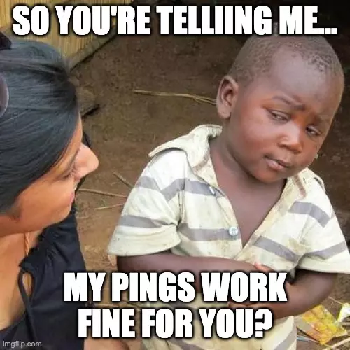
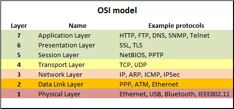
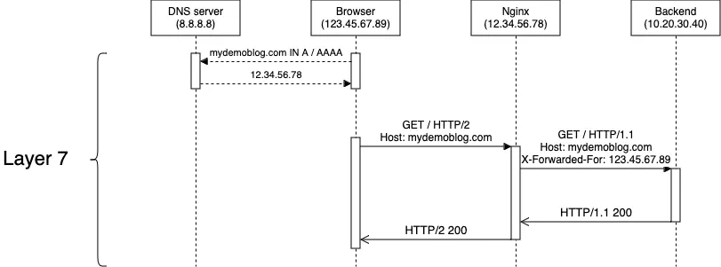
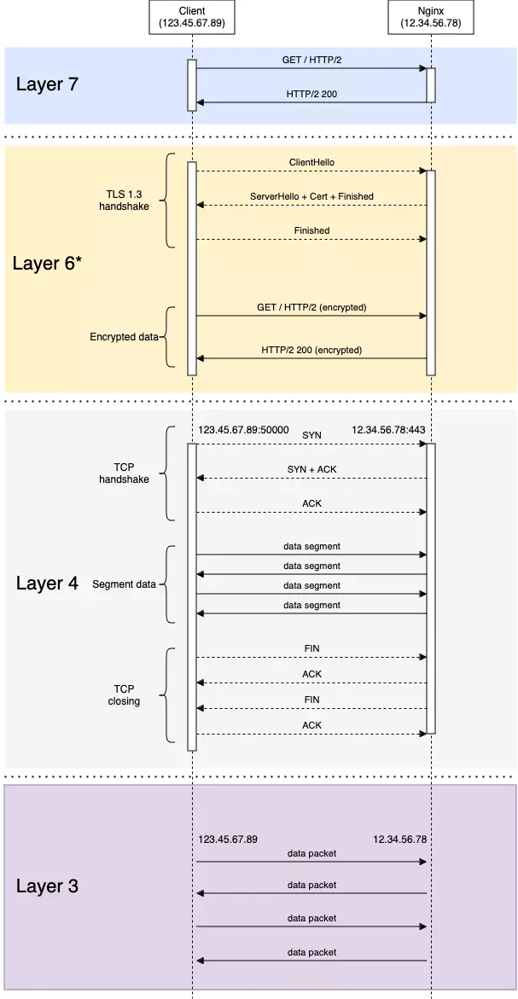
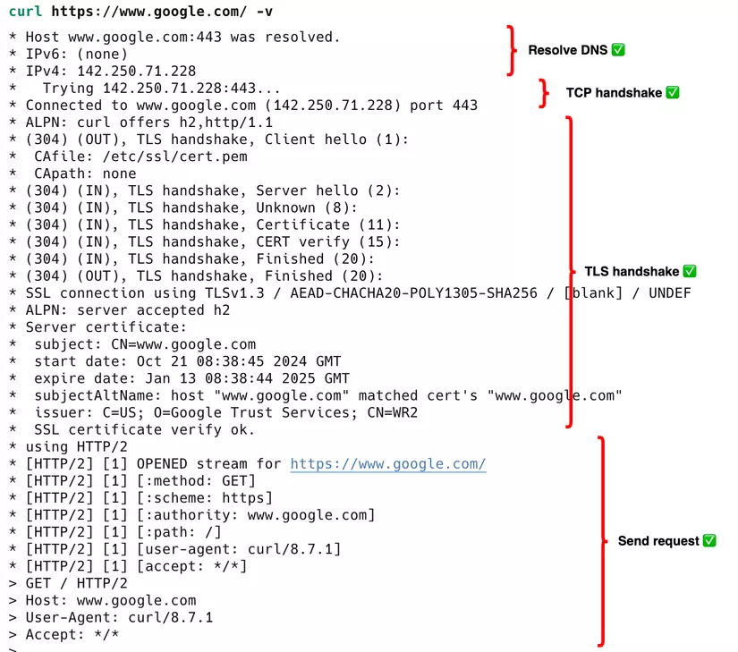

Khi công việc nhàm chán hàng ngày của những người DJ (đi dây) mạng được tổng hợp lại thành bí kíp võ công thì sẽ thế nào?

## TL;DR

Huyền thoại DevOps Lý Tiểu Mon đã có câu:

> Tôi không sợ người dùng 10.000 tools tracing trong CNCF chỉ một lần mà chỉ sợ người đã dùng tcpdump debug 10.000 lần

Networking, OSI model,... trong mắt nhiều người có thể là thứ "cơ bản đến mức khỏi phải bàn", "ai làm nghề này mà chả phải biết",... nên nhiều khi bị bỏ quên trong quá trình học và làm của một cơ số bạn trẻ đu trend DevOps mấy năm gần đây. Phần vì thiếu sự trải nghiệm thực tế, phần cũng bởi vì sự thổi phồng quá mức của mấy từ khóa như Kubernetes, AWS, CI/CD, IaC,... của mấy trung tâm chăn nuôi gia cầm ngắn hạn nên người ta giờ chỉ nhăm nhăm đi học mấy chứng chỉ fancy như "nhà thiết kế đám mây chuyên nghiệp" hay "nhà phát triển ứng dụng trong hộp chứa hàng" mà quên mất đi những kiến thức được gọi là nền tảng, gốc gác như networking.

Không phải tự nhiên mà những công ty, tập đoàn lớn khi tuyển dụng những vị trí senior 8-10 năm kinh nghiệm vẫn còn hỏi những câu hỏi tưởng chừng "ngây ngô" như:

- Bắt tay 3 bước là gì?
- Sự khác nhau giữa TCP và UDP?

Hóa ra người ta không ngây ngô, bởi vì chính mấy câu hỏi tưởng chừng không nguy hiểm này lại thường dẫn đến những cú ngã chí mạng vì mất gốc của bạn. Nhưng thôi, đó là chuyện khi phỏng vấn. Còn thực tế khi làm việc thì nó có quan trọng vậy không?

## First things first

Mình là **Minh Monmen**, hiện tại đang làm công việc rất chi là thời thượng là **SRE**(Site Reliability Engineer) cho một công ty AI đến từ Nhật Bổn. Và bài viết này là một trong những phần chia sẻ bên lề cho series: **DevOps training** của mình. Các bạn có thể truy cập link này để xem lộ trình tự học DevOps mình đã từng trải qua như thế nào nhé: [Từ backend học DevOps qua việc Do-It-Yourself](https://viblo.asia/p/tu-backend-hoc-devops-qua-viec-do-it-yourself-aNj4vvk246r).

Trở lại với câu hỏi về sự ra đời của bài viết này: Kiến thức networking có quan trọng trong quá trình làm việc thực tế không?

Thì câu trả lời chắc chắn là **Có** nhé. Khi làm công việc của DevOps, SRE hay System Admin, bạn có thể không cần nhớ đến con trỏ (pointer), hashmap, linked list,... hay những thứ phức tạp của bộ môn "Cấu trúc dữ liệu và giải thuật" làm gì, nhưng networking sẽ là thứ bạn làm hàng ngày, hàng giờ, làm đi làm lại, hết kiểu này đến kiểu khác, hết ứng dụng này đến ứng dụng khác luôn ấy. Trust me bro, nếu một năm có 365 ngày mà bạn đều phải đi làm, thì chắc chắn đến 100 ngày trong số đấy là thời gian các bạn ngồi cấu hình networking, firewall, port, NAT,... rồi dành toàn bộ 265 ngày còn lại để khóc lóc, cầu nguyện, debug tại sao nó không thông, tại sao nó timeout, tại sao nó reset, tại sao nó drop,... 

Và để 265 ngày đó của bạn dễ thở hơn, mình đã nghĩ tới bài viết này.

Tất nhiên, đọc 1 bài viết không khiến các bạn tinh thông kiến thức sách giáo khoa được. Điều đó bạn phải tự ý thức được mà làm. Bài viết này chỉ là cung cấp phương pháp debugging cơ bản để nếu các bạn gặp vấn đề với networking (hay nếu rộng hơn là bất cứ vấn đề gì) thì sẽ biết phải bắt đầu từ đâu chứ đừng lên mạng hỏi như này người ta không thèm trả lời đâu: "Các anh ơi em trỏ domain vào server của em rồi, ping domain thấy được mà vào web browser lại không được là tại vì sao?" =)))

Oke chưa? Let's go!

## Thu thập thông tin sự cố

Việc đầu tiên cần làm với bất kỳ sự cố nào là thu thập thật nhiều thông tin. Thông thường là qua log của ứng dụng, exception, network tab (trên browser),... Đây cũng là kiến thức debugging cơ bản mà developer nào cũng phải nắm được. Có rất nhiều bạn trẻ vô group DevOps chỉ hỏi tại sao em cài cái này không hoạt động, chạy cái kia lỗi,... mà không có thông tin nó lỗi ra sao, log thế nào luôn. 

Một số exception và lỗi sau có thể là dấu hiệu cơ bản của vấn đề liên quan tới networking:

- DNS lookup failure, unknown host, hostname, domain....
- Connection refused, timeout, connection reset,...
- Network is unreachable, no route to host,...
- Potential Security Risk warning, expired, untrust certificate,...
- Blocked by CORS, Content Security Policy,...

## Tái hiện sự cố

Đây là bước cực kỳ quan trọng, vì nó còn được dùng để kiểm tra xem bạn đã thật sự xử lý xong sự cố hay chưa, thậm chí chỉ cần bạn chọn đúng input để tái hiện sự cố thì đã nhìn ra 80% vấn đề rồi.

- Nếu sự cố vẫn đang diễn ra với tỷ lệ xuất hiện 100% (luôn luôn lỗi) ~> chúc mừng, ít ra nó tạo cơ hội cho bạn dễ dàng xác định lỗi ở đâu và verify nó. Hãy ghi lại mọi yếu tố đầu vào (input) phát sinh lỗi để tái hiện.
- Nếu sự cố diễn ra với tỷ lệ xuất hiện thấp, điều này sẽ gây khó khăn cho quá trình debug của bạn, hãy dựa theo các chiến lược sau:
    + Mở rộng phạm vi input để tìm ra quy luật và điểm khác biệt với các input thành công. Ví dụ:
        + Cứ tới request thứ 3,6,9,... lại lỗi sẽ gợi ý cho bạn tới case khi round-robin tới 3 server mà 1 trong 3 con đó bị lỗi
        + Cứ sau 15 phút lại có 1 log connection reset sẽ gợi ý cho bạn tới case timeout của 1 connection dài hạn nào đó
        + User ở Mỹ, EU thì bình thường mà user ở VN lại timeout thì sẽ nghĩ tới cái gì là điều khác biệt? CDN server location? Language? Firewall?
    + Nếu lỗi xảy ra một cách ngẫu nhiên và bạn không thể tìm được quy luật? Đây là case tệ nhất, mất thời gian nhất khi bạn sẽ buộc phải đặt debug logging, tracing, packet capture,... trong một thời gian dài để có thêm thông tin khi xảy ra lỗi. Nếu bạn đen mà rơi vào case này, thì hãy chuẩn bị sẵn tâm thế có thể việc debug quá tốn thời gian, không đi tới đâu và bạn phải chấp nhận sống chung với lỗi để làm những thứ khác có ý nghĩa hơn.

## Khoanh vùng component và layer network xảy ra sự cố

Để làm được điều này thì trước hết bạn phải hiểu được ứng dụng của bạn giao tiếp với nhau thế nào, qua protocol gì đã. Dù bạn có là DevOps, System Admin,... bất kỳ ai **không code ứng dụng đấy** thì cũng cần phải hiểu được cách mà ứng dụng đó giao tiếp với môi trường xung quanh. Thông thường networking thường là nơi xảy ra vấn đề nhiều nhất là bởi để một ứng dụng hoạt động thì hệ thống network giao tiếp của nó vừa bao gồm nhiều thành phần, mỗi thành phần kết nối với nhau lại qua nhiều layer network trong mô hình OSI, với sự tham gia của nhiều protocol ở các layer khác nhau,... Ở đây ngoài việc vẽ một cái **sơ đồ chiều ngang chứa các component trong network**, các bạn còn cần phải vẽ thêm cả một **sơ đồ chiều dọc dựa theo các layer** nữa.

> Đây thường là bước bị xem là không cần thiết, nhưng chỉ là đối với những senior đã quá quen với việc debug networking thôi. Họ có thể nhận ra lỗi xảy ra ở bước nào ngay lập tức từ khi thấy log lỗi. Thế nhưng nếu bạn chưa đạt tới level đó thì mình khuyên bạn cứ vẽ ra để tránh lạc hướng lại mất thời gian hơn nhé.

Một số protocol ở các layer:

> TIPS: Thông thường những sự cố bạn gặp khi làm DevOps sẽ là các sự cố từ layer 3 (Network Layer) tới layer 7 (Application Layer). Tức là thường sẽ bỏ qua phần hạ tầng network phần cứng bên dưới. Trừ khi bạn làm ở những môi trường có yêu cầu đặc biệt, còn không chúng ta tạm thời bỏ qua 2 layer dưới cùng để tập trung vào những vấn đề thường gặp thôi nhé.

Sau khi có sơ đồ hệ thống networking, bạn sẽ có 2 hướng tiếp cận để kiểm tra khác nhau:

- Top-down: Xác định vấn đề theo chiều từ layer cao xuống thấp. Cách này thường dùng để xác định nhanh khu vực xảy ra lỗi trong một kiến trúc phức tạp khi lấy kết quả của các layer trên để biết hoạt động của các layer phía dưới có bình thường không.
- Bottom-up: Xác định vấn đề theo chiều từ layer thấp lên cao. Cách này thường dùng để kiểm tra cụ thể lỗi xảy ra ở layer nào, vị trí nào sau khi đã khoanh vùng.

Ví dụ:

- Mô tả lỗi: **Truy cập vào trang web `https://mydemoblog.com` hiển thị timeout** (tên miền này ví dụ thôi)
- Tái hiện: Bằng browser khi truy cập `https://mydemoblog.com`.
- Sơ đồ hệ thống `mydemoblog.com` cơ bản của tui:

Tiếp cận theo hướng top-down thì mình sẽ liệt kê ra:

- Các hoạt động được thực hiện ở layer 7:
    + Browser sử dụng DNS protocol để phân giải tên miền `mydemoblog.com` ra IP của Load Balancer (LB)
    + Browser sử dụng HTTPS (HTTP + SSL/TLS) protocol để gửi request tới IP LB vừa phân giải + port 443
    + LB ở đây (nginx) hoạt động ở layer 7 sẽ đọc nội dung request, thực hiện routing để tìm server backend phù hợp sẽ nhận request
    + LB sử dụng HTTP protocol để tạo 1 request mới có nội dung lấy từ request gốc gửi tới IP backend + port 80
    + Backend (NodeJS) process request, trả về HTTP response cho LB
    + LB nhận được HTTP response từ backend server, thực hiện thay đổi (nếu cần) và trả về HTTP response cho browser
- Thử từng bước để xác nhận bước đó hoạt động đúng, nếu đúng thì kiểm tra bước kế tiếp
    + Kiểm tra DNS xem `mydemoblog.com` đã phân giải đúng IP của LB chưa với `nslookup`, `dig`, `curl -vvv`,...
    + Kiểm tra việc gửi request từ terminal tới LB có thành công không bằng `curl -vvv`.
    + Kiểm tra access log, error của LB để xem request có tới không, có lỗi gì khi connect backend không.
    + Trả response từ LB sớm cho client bằng việc sửa config không gọi tới backend, request tới URL đặc biệt, URL không tồn tại,... để xác nhận kết nối client - LB.
    + Kiểm tra log backend (nếu có) xem có nhận được request không, có lỗi khi xử lý hay phải chờ DB,... gì không
    + Trả response mà không xử lý để loại trừ các yếu tố về dữ liệu hay thành phần thứ 3, gọi thử URL không tồn tại để xác nhận kết nối client - LB - BE
    ...

Ở từng bước xác nhận nhỏ mình có thể tiếp cận theo hướng bottom-up để xác nhận khu vực đó hoạt động bình thường.

Nếu phóng to kết nối giữa browser -> nginx lên thì ta có sơ đồ như sau:

Tiếp theo mình sẽ kiểm tra từ các layer thấp lên cao. Ví dụ như:
- Ping thử domain `mydemoblog.com` để kiểm tra phân giải DNS kết hợp với kết nối layer 3 (network) tới IP của LB. Lưu ý quan trọng là ping sử dụng giao thức riêng là ICMP ở layer 3 và có thể bị các lớp firewall chặn còn truy cập web thì không - hoặc ngược lại. Do đó kết quả của ping chỉ mang tính tham khảo là mạng của bạn có routing được tới LB hay không, ping ok thì là routing được nhưng ping fail thì **chưa chắc** đã không routing được).
- `telnet` để xem kết nối TCP (layer 4) tới LB có hoạt động không, phía LB đã listen port 443 chưa, có chặn port 443 không,...
- `curl -vvv` với response chi tiết từ TCP handshake ở layer 4 đã thành công chưa, SSL/TLS handshake (~ layer 6) đã thành công chưa, gửi được request (layer 7) thành công chưa,...

## Các công cụ sử dụng trong quá trình debug

Để thực hiện được việc khoanh vùng phía trên, ngoài sơ đồ hệ thống chi tiết ra thì bạn còn phải có công cụ phù hợp với các layer khác nhau/layer khác nhau để kiểm tra nữa. Dưới đây là một số công cụ phục vụ việc debugging ở từng layer:

|         | Tools                                                                    |
| ------- | ------------------------------------------------------------------------ |
| Layer 7 | curl, dig, nslookup, burpsuite, wireshark, charles, mqttx, redis-cli,... |
| Layer 4 | telnet, nmap, netcat, tcpdump, netstat, iptables,...                     |
| Layer 3 | ping, traceroute, tracepath, route,...                                   |

Bạn nên tập dùng tất cả các công cụ trên, vì kiểu gì cũng có lúc dùng tới. Chắc chắn là không thừa đâu. Đặc biệt là `curl`, một công cụ cực mạnh để debugging các loại HTTP request, với việc thêm `-vvv` bạn sẽ có thông tin khá đầy đủ từ các bước phân giải DNS ra sao, kết nối tới IPv4 hay IPv6 (layer 3), TCP handshake thành công không (layer 4), SSL/TLS handshake thành công không (~ layer 6), HTTP request thế nào response header ra sao (layer 7). 80% các lỗi liên quan tới HTTP thường gặp có thể được phát hiện ra bởi curl.

> Lưu ý: browser khi gọi HTTP sẽ tự động thêm 1 số header về user-agent, compression, cookie,... do đó khi test bằng curl cũng không nên bỏ qua việc mô phỏng lại chính xác request từ browser (mở tab Network, chuột phải vào 1 request và Copy As Curl). Có rất nhiều trường hợp vì firewall chặn browser nhưng curl vẫn thông (hoặc ngược lại).

## Khoanh vùng xong thì làm gì?

Sau khi bạn đã xác định được vùng lỗi gồm component lỗi và layer bị lỗi rồi thì đây là những thứ bạn cần kiểm tra và thử thay đổi:

### Sự cố ở bước DNS

Gồm các sự cố như:

- Không phân giải được ra IP
- Phân giải ra IP không đúng
- Phân giải ra IP không phù hợp với network stack của client (ví dụ client chỉ có IPv6 nhưng DNS chỉ config IPv4)

Cần kiểm tra:

- Bản ghi DNS trên các máy chủ (từ khóa: Global DNS Propagation Checker)
- DNS server của client
- Proxy/VPN/Network của client, những thứ có thể can thiệp vào DNS trên máy client
- Network/Firewall trong mạng nội bộ của client trước khi client ra Internet (thường các mạng doanh nghiệp đều có kiểm soát DNS của các client bên trong thông qua việc trỏ DNS server nội bộ hoặc can thiệp trực tiếp vào traffic DNS)
- Nhà cung cấp mạng (ISP) của client (rất khó xác nhận nếu đã làm tới bước này, nhưng cũng không loại trừ khả năng ISP của client có lọc những DNS có vấn đề như po*n chẳng hạn)

Tools: `dig`, `nslookup`.

### Sự cố ở layer 3

Gồm các sự cố liên quan tới:

- Không thể gửi và nhận packet được tới 1 IP (no route to host)

Ở layer này có thể có sự tham gia của một số component **ẩn** mà trên sơ đồ trên mình chưa vẽ ra, cũng ít khi được để ý tới như: NAT gateway, router (nhà bạn), ISP network hop, cloud connection (VPC peering),... giúp cho việc routing packet tới đúng nơi. Bạn đều nên kiểm tra.

Cần kiểm tra 2 chiều:

1. Chiều packet client -> server:

- Route table của client, interface mạng đầu ra, VPN của client
- Route table của network giữa client và server. Nếu đều nằm trong mạng nội bộ thì kiểm tra route table qua từng hop trong mạng. Nếu server có IP public internet thì kiểm tra route table trong mạng của client tới được internet.
- Firewall outgoing của chính client, firewall outgoing trong network của client,... có chặn packet tới IP của server không.
- Firewall incoming của network server, firewall incoming của server,... có chặn packet đến từ IP của client không.

Thông thường lỗi ở đây thường tới từ route table nhiều hơn, còn chặn bằng firewall từ layer 3 thì thường gặp với case blacklist IP thôi.

2. Chiều packet server -> client:

Tương tự với chiều client -> server nhưng theo hướng ngược lại thôi. Tập trung vào route table ngược lại. Đây thường là phần hay bị bỏ quên nhất vì mọi người "nghĩ rằng" traffic đi theo đường nào thì sẽ trở lại đường đó nên chỉ cần thấy thông được 1 chiều là xong. Nhưng thực chất ở layer 3, mỗi gói tin được routing với thông tin duy nhất là IP sẽ phải độc lập mà tự tìm đường đi tới đích cho mình. Gói tin từ server -> client cũng vậy, phải tự tìm đường trở lại IP của client theo route table chiều ngược lại chứ.

Tools: 
- `ping`: kiểm tra IP có reachable không với giao thức ICMP
- `traceroute`, `tracepath`: kiểm tra routing path 
- `route`: kiểm tra route table của client

### Sự cố ở layer 4

Gồm các sự cố liên quan tới:

- Connection timeout, connection reset, connection refused,...

Ở đây thì sẽ có thể có sự tham gia của một số component **ẩn** chạy trên layer 4 như L4 Load Balancer, NAT gateway, Firewall...

Cần kiểm tra:

- Firewall outgoing của client, firewall outgoing network nội bộ của client đã allow server IP + port server chưa
- Firewall incoming network của server, firewall incoming trong server đã allow client IP + port server chưa
- Application trong server đã listen đúng port chưa, đúng interface chưa

Tools: 
- `telnet`: kiểm tra kết nối tới `<ip>:<port>` có thông không
- `netcat`: kiểm tra việc gửi dữ liệu qua mạng
- `tcpdump`: capture package gửi đi từ client và gửi đến server
- `netstat`: kiểm tra các port đang mở, trạng thái và thông tin các kết nối
- `iptables`: kiểm tra firewall đầu vào trên server, đầu ra trên client

### Sự cố ở layer 7

Gồm các sự cố liên quan tới:

- Request timeout
- Response with error (4xx/5xx HTTP status code,...)
- SSL/TLS error
- Tất cả các loại lỗi liên quan tới nội dung bên trong request/response (thiếu header, permission denied, malformed format, CORS,...)

Cần kiểm tra:

- Config server (domain, header, timeout,...)
- Application firewall, antivirus,...
- Certificate, TLS version, SSL config,...
- Nội dung request/response

Tools: 
- `curl`, `mqttx`, `redis-cli`, `mongosh`, `openssl`: Trực tiếp gửi và nhận data qua các giao thức layer 7
- `burpsuite`, `wireshark`, `charles proxy`: Nếu không thể trực tiếp gửi và nhận data thì dùng các tool này capture data ở giữa kết nối client->server để kiểm tra nội dung

## Tổng kết

Sau bài viết này, mình rút ra một số kinh nghiệm debugging cho các bạn:

- Để có thể debug hiệu quả, bạn phải thật sự hiểu kết nối đó đang hoạt động thế nào, mỗi layer sẽ làm gì trước làm gì sau. Debug khi chưa hiểu nó hoạt động ra sao sẽ khiến các bạn chỉ biết "thử mù", "fix được do may mắn" chứ không trở thành lối tư duy giúp bạn xử lý mọi sự cố được. Mình định sẽ tiếp tục chia sẻ theo hướng giải thích cách hoạt động một số mô hình thường gặp qua việc bóc tách chi tiết các layer. Các bạn hãy đón đọc nhé.
- Bức tranh tổng thể rất quan trọng, vẽ hình ra giúp các bạn suy nghĩ mạch lạc hơn. Đừng ngại trừ khi các bạn đã rất thông thạo mô hình đó rồi.
- Tạo checklist rõ ràng khi kiểm tra từng layer và từng component theo thứ tự mình nói ở trên để hiểu được khi mình kiểm tra thế này thì cái gì đã hoạt động, cái gì không.
- Chia nhỏ và cô lập hoạt động của từng thành phần để xác định xem nó đã hoạt động chưa dễ hơn. Ví dụ đang gặp lỗi với kiến trúc client -> LB -> server ở trên, ta có thể cô lập kết nối của client -> LB bằng cách request 1 url/domain không tồn tại tới LB để xem nó có trực tiếp báo lỗi sớm không.

Bài viết này nằm trong khuôn khổ sự kiện chia sẻ Advent of Sharing thường niên tổ chức tháng 12 của cộng đồng [Webuild](https://www.facebook.com/webuildx), hẹn các bạn trong các bài viết tới nhé.