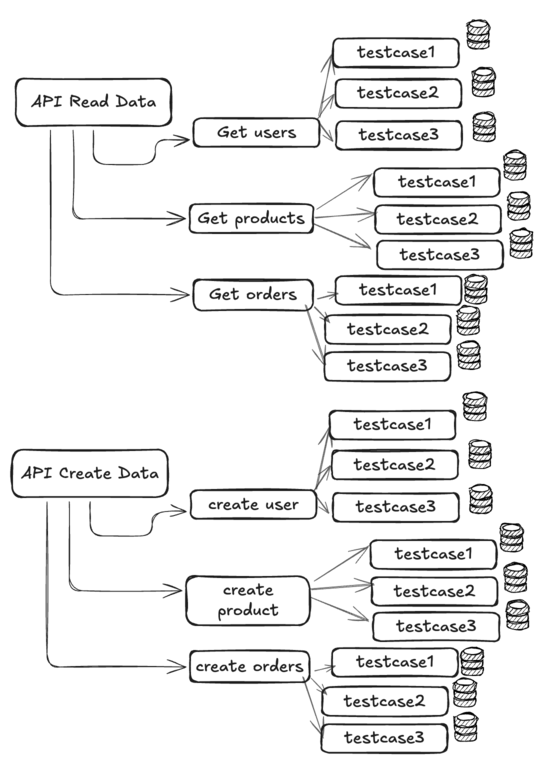
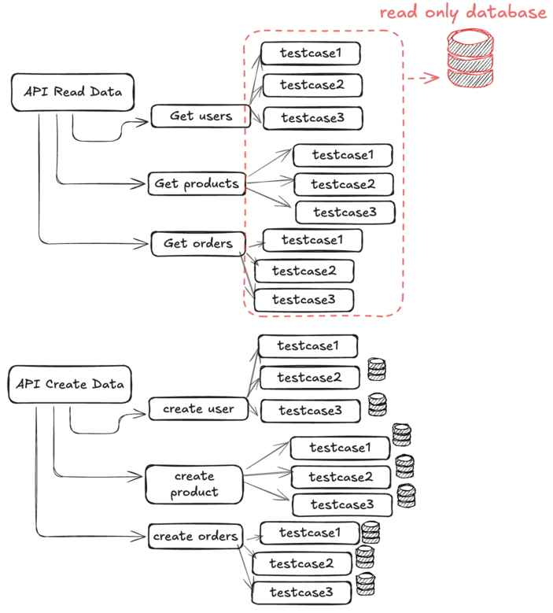
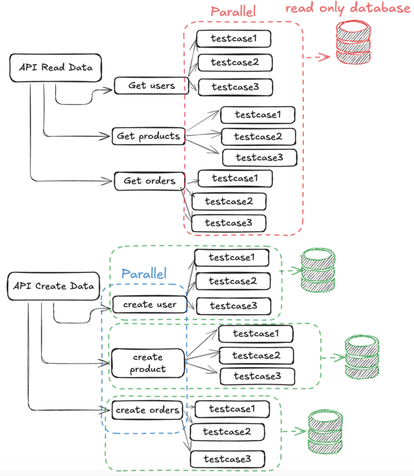

# Lạm dụng Parallel(Golang) trong integration test và cách giải quyết

## Vấn đề
Khi tham gia một dự án mới với vai trò Backend Developer, mình nhận được nhiệm vụ từ sếp:
> "Setup hệ thống test cho dự án, ưu tiên tốc độ thực thi nhé! Anh nghe nói có thể tăng tốc tốc độ thực thi test trên golang bằng `t.Parallel()` triển khai thử xem sao."

Nghĩ rằng yêu cầu này không quá khó, mình bắt đầu xây dựng unit test trước vì đơn giản và phù hợp với yêu cầu. Dự án sử dụng Golang, và nhờ có `t.Parallel()`, mỗi test case có thể chạy song song dưới dạng các goroutine độc lập trong cùng một process. Mọi thứ ban đầu rất suôn sẻ – tốc độ nhanh, sếp hài lòng.

Sau đó, mình chuyển sang integration test, vốn phức tạp hơn vì cần tương tác với database. Để tránh xung đột dữ liệu giữa các test case, mình quyết định mỗi test case sẽ sử dụng một test DB riêng. Quy trình này gồm:
1. Tạo test DB
2. Insert records vào test DB từ fixtures
3. Thực thi testcase bằng cách giả lập 1 luồng HTTP request, nhận response từ API và so sánh response với kết quả mong đợi
4. Xóa DB

Mình sẽ thiết kế như sau, hệ thống của mình sẽ bao gồm nhiều bộ test cho từng API
- Mỗi bộ test sẽ có nhiều testcase
  - Mỗi testcase chỉ sử dụng 1 test DB riêng biệt

Và integration test cho hệ thống cũng xong, chạy thử ở local và trên CI cũng ổn, Tuy nhiên…

## Dấu hiệu integration test chậm
Sau phase 1 của dự án, các API cũng tăng dần, thành viên của team cũng tăng lên, lúc này integration test trên CI đã chậm hơn, mất tận 15 phút.

Test thử ở local, chạy 1 test riêng biệt thì khá nhanh,  nhưng chạy hết thì cũng không nhanh hơn trên CI mấy, tận 10 đến 12 phút

## Phân tích và giải pháp
Bắt đầu chạy test nhiều lần, và nhận ra rằng 70% thời gian thực thi được dùng ở bước tạo database, schema migration, load fixtures. Để cải tiến hệ thống, mình chia nhỏ và giải quyết 2 bài toán như sau, tập trung vào hướng **giảm thiểu database**:
1. Cải thiện tốc độ thực thi cho API chỉ đọc dữ liệu
2. Cải thiện tốc độ thực thi cho API ghi dữ liệu

#### 1. Cải thiện API chỉ đọc dữ liệu

Đối với các loại API này, nghĩ kĩ lại thì thì mỗi test case sử dụng 1 database riêng là việc dư thừa, vì dữ liệu là toàn vẹn trong quá trình test, thay vào đó, ta sẽ dùng chung **1 database** cho các test case chỉ đọc dữ liệu.

Ý tưởng:
- Tạo ra 1 test db, đặt tên là readOnlyDB
- Load fixtures cho readOnlyDB
- Ở mỗi testcase, ta vẫn sử dụng t.Parellel() và khởi tạo test API với db này.

#### 2. Cải thiện API ghi dữ liệu
Vẫn giữ ý tưởng ban đầu, vì mỗi test case đều áp dụng `t.Parallel()`, ta vẫn sẽ khởi tạo 1 database riêng cho mỗi test case, nhưng điều này thật sự chưa ổn vì

- Chi phí về mặt thời gian và tài nguyên để tạo ra 1 database cho 1 test case là khá cao
- Fixtures có thể thừa thải bởi vì 1 test case thì chỉ test những data liên quan. Ví dụ, fixtures là tạo ra 10 records cho các table users, products, orders, nhưng test case của mình chỉ dữ liệu của bảng orders)
- Số lượng kết nối database sẽ tăng cao nếu test case ngày càng nhiều
- Không phù hợp khi triển khai trên CI vì hạn chế tài nguyên

Hướng đi duy nhất trong đầu mình là làm sao hạn chế số lượng database tạo ra, điều này khả thi nhưng sẽ đánh đổi là không sử dụng cơ chế Parallel

Ý tưởng:
- Các bộ test sẽ sử dụng 1 database duy nhất, mỗi test case ta sẽ để chúng nó chạy đồng bộ
- Mỗi bộ test ta sử dụng 1 fixtures riêng biệt để tránh tạo data thừa trong database
- Để tránh xung đột dữ liệu, mỗi test case sẽ chạy đồng bộ rồi rollback data sau khi ghi vào database test.

## Kết quả
Sau khi cải thiện, từ diagram ban đầu, test của mình cần 18 test database thì giờ chỉ cần 4 database thôi. Thời gian thực thi cũng khá ổn, trên CI chỉ còn 7 phút hơn là đã chạy xong integration test. Và mình chốt ra được điều này, áp dụng `Parallel ít - Database Ít` ổn hơn là `Parallel nhiều - Database nhiều`.

Điều mình học được từ quá trình này:
> Không thể áp dụng một giải pháp cho 2 bài toàn khác nhau: Với unit test, Parallel thật sự làm tốt vì tính độc lập của nó, nhưng với integration test, ta cần xem xét kĩ hơn đặc biệt là có sự tương tác với thành phần bên ngoài như database, storage service, mail service, etc…

Và đó là những gì mình đã đúc kết được trong quá trình tìm tòi và cải thiện cách triển khai integration test cho API. Hy vọng những chia sẻ này sẽ hữu ích đối với bạn.
