# Things You May Already Know About Cookies

Bạn đã bao giờ tự hỏi điều gì giúp các website "nhớ" được bạn, từ tài khoản đăng nhập đến sở thích duyệt web? Đó chính là nhờ Cookies! Cookies là những tệp dữ liệu nhỏ được lưu trữ trên thiết bị của bạn mỗi khi ghé thăm một trang web. Chúng không chỉ ghi nhớ các tùy chọn cá nhân hay trạng thái đăng nhập, mà còn giúp trang web hoạt động mượt mà hơn, tối ưu trải nghiệm duyệt web của bạn.

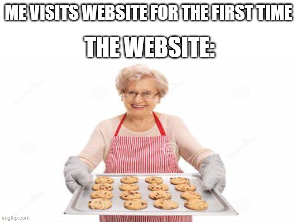

Hãy nghĩ về Cookies như những "ghi chú bí mật" mà website để lại; dành cho những lần sau truy cập. Vậy cookies thực sự hoạt động ra sao, và chúng có ảnh hưởng gì đến bạn? Hãy cùng tìm hiểu vào lần sau nhé.

Còn lần này, chúng ta nói về bánh Cookie, không phải về web Cookie!!!

Nhưng đầu tiên, chúng ta hãy nói về bánh Cookie nào đã.
Cái mình muốn đề cập ở đây là bánh Cookies mà ở cái xứ mộng mơ, người ta hay nhắc tới, The American Cookies:

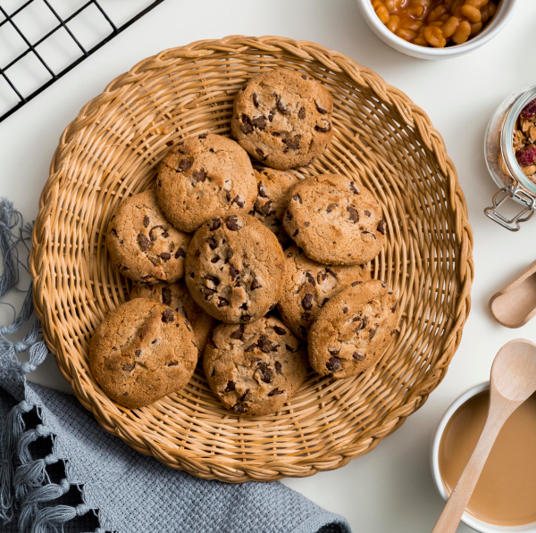

Nhưng ở Châu Âu và Vương quốc anh thì gọi bánh Cookies ở Mỹ đấy là bánh Biscuit. Nhưng quay ngược lại Mỹ, bánh Biscuit ở Mỹ thì trông nó lại như vầy:

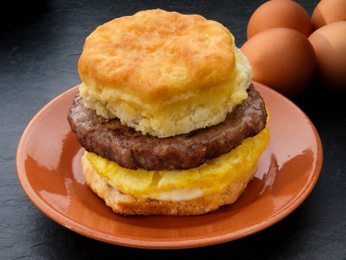

Và không phải tất các loại bánh được gọi là Biscuit ở Châu Âu và Vương Quốc anh thì đều chỉ về bánh Cookies ở Mỹ, mà bánh Crackers cũng là 1 dòng bánh Biscuit ở Châu Âu và Vương Quốc anh. Nhưng bánh Crakers thì không phải là một dòng bánh Cookies ở Mỹ:

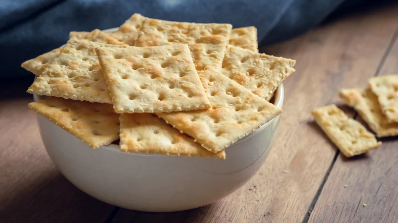

Sự khác nhau lớn nhất giữa bánh Crackers so với Cookies là Crackers thường giòn, lượng đường trong bánh ít (khỏang dưới 30%).

Và bằng một cách thần kỳ nào đấy, cái bánh này ở Thuỵ Điển cũng được gọi là Cookies:

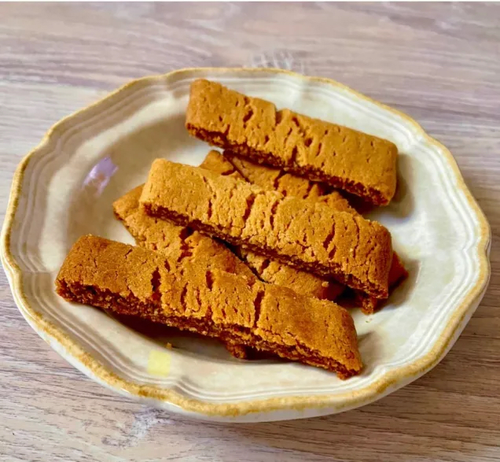

Rời ra sự văn minh của các nước phương tây, ở xứ kim chi củ cải, cái bánh ướt ướt, dẻo dẻo Yakgwa này cũng là một loại Cookies:

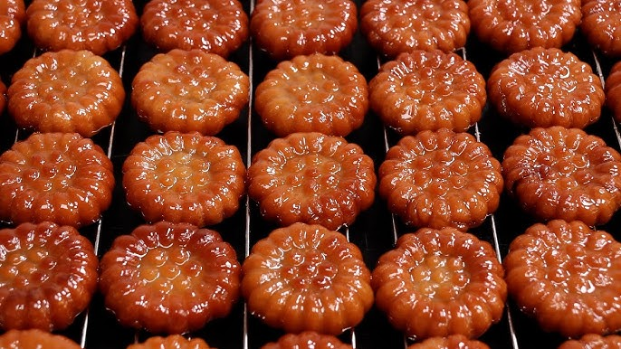

Và gần hơn nữa, nơi thường xuyên để chứa kim chỉ hơn là bánh, thì đây cũng là một loại Cookies:

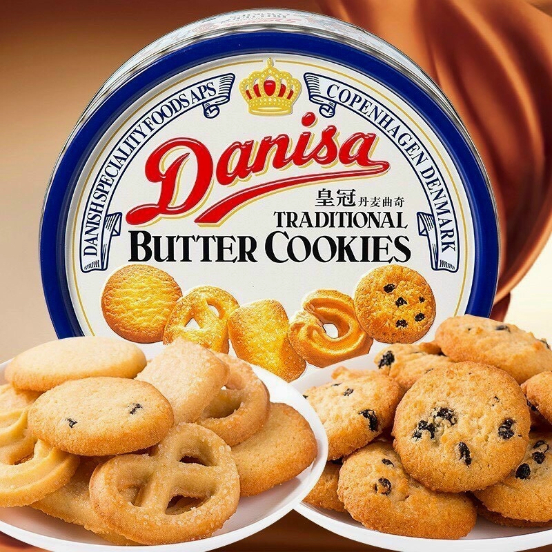

Như các bạn đã thấy, dù chỉ là những chiếc bánh nhỏ; giống như member <TuHoang> ở WeBuild; có rất nhiều tên và phiên bản khác nhau khi ở các nước khác nhau.
Nhưng để cho dễ, hôm nay mình xin phép nói riêng về Cookies ở Mỹ và phiên bản Biscuit ở Châu Âu thôi nhé.

Theo như nhiều thông tin chưa được xác thực, trust me bro, những mẩu bánh nhỏ được sử dụng ở Persia vào thế kỷ thứ 7 sau công nguyên, dùng để kiểm tra nhiệt độ lò trước khi thợ bánh nướng bánh mì. Những mẩu bánh nhỏ này là phiên bản đầu tiên của bánh Cookies mà chúng ta thấy ngày nay.

Theo dòng lịch sử, do bánh Cookies thường khô ráo và giữ được rất lâu, nên được binh lính, những người di cư và thuỷ thủ đi biển mang theo trong những chuyến đi dài ngày. Từ đấy, những mẩu bánh Cookies được lan rộng và phổ biến khắp thế giới, cũng như có nhiều phiên bản cho riêng mình.

Ở Mỹ, phiên bản bánh Cookies socola chip được phổ biến rộng rãi; thật ra ban đầu là do một tai nạn khi người tạo ra nó hết bột ca cao và tính sử dụng những mẩu vụn socola và hi vọng nó tan ra trong quá trình nướng. Nhưng nào ngờ những mẫu socola vẫn giữ nguyên hình dạng, và sau đó thì nó trở thành lịch sử.

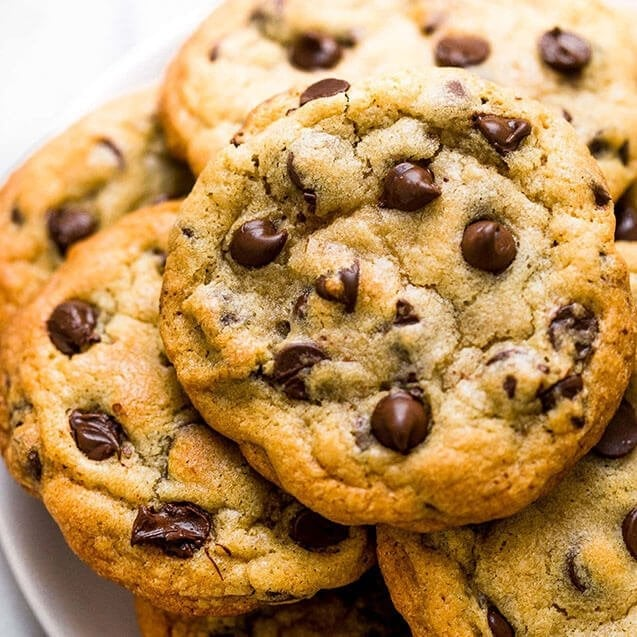

Ở Ý, người ta có một dòng bánh Cookies nổi tiếng tên là Macaroon, được làm chủ yếu từ lòng trắng trứng, đường, và dừa nạo. Trông nó như vầy:

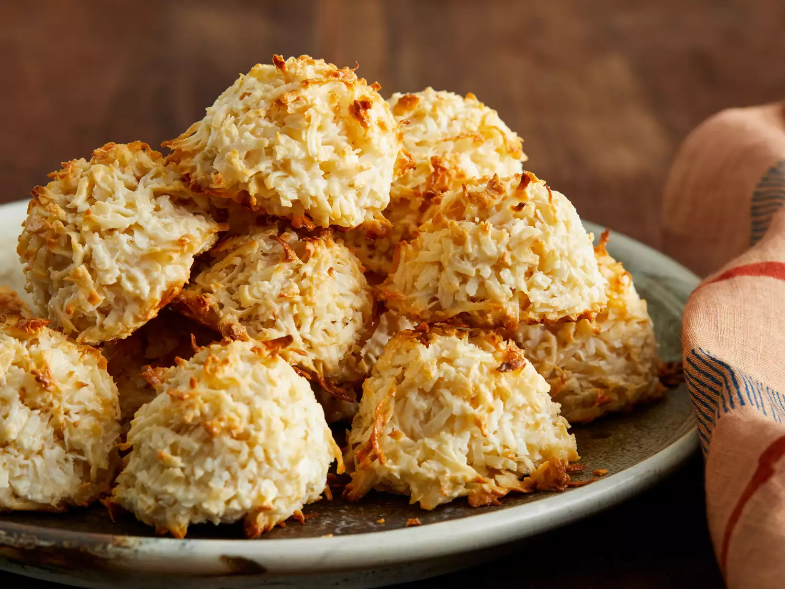

Còn cái Cookies Macaron mà mọi người đang nghĩ trong đầu thì nó xuất phát từ Pháp, và được làm từ lòng trắng trứng, đường và bột hạnh nhân:

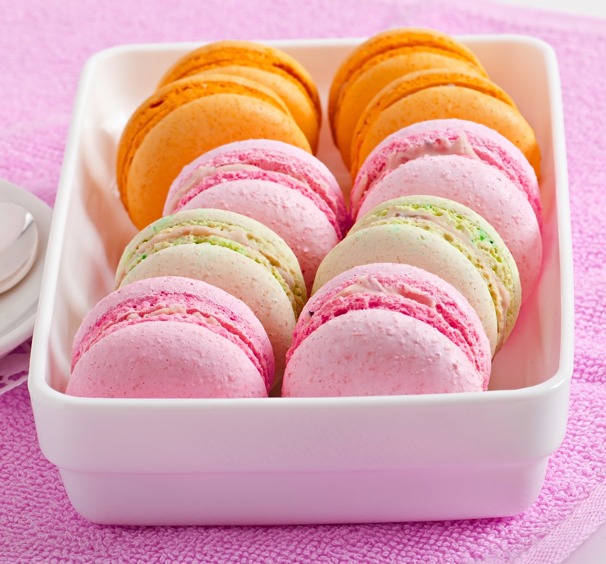

Mặc dù hai loại Cookies này trông khác nhau nhưng rất dễ bị nhầm lẫn với nhau vì cách viết chỉ khác nhau một chữ "o".

Một sự hiểu lầm khác về một loại bánh cookies nữa là Fortune Cookies,

Thì như bạn đã biết, bánh Fortune Cookies này chắc chắn không được tạo ra ở Trung Quốc hoặc ở các nước Châu Á, nó được tạo ra ở Mỹ. Nhưng nó cũng không được tạo ra bởi người Trung Quốc hay người Mỹ, mà được tạo ra bởi người Nhật, nhập cư sang Mỹ, và sau đó được lan rộng ra các cửa hàng Trung Quốc ở Mỹ nên người ta lầm tưởng đây là một món ăn truyền thống của người Trung Quốc ở Trung Quốc chứ người ta không nghĩ đây là một món ăn được tạo ra ở Mỹ bởi người Nhật nhập cư sang Mỹ...

Sẵn vì chúng ta đang lan man với những người bạn Nhật, chúng ta hãy nói về Unagi Pie, một loại bánh cookies giòn được người Nhật làm ra với chiết xuất và hương vị từ lươn, con lươn ấy mọi người. Và nó cũng không giống bánh Pie lắm đâu, nhưng rất tốt cho sinh lý (hoặc ít nhất mọi người nghĩ thế).

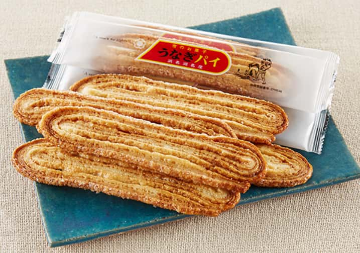

Chúng ta quay về với Châu Âu, ở Hà Lan xa xôi, cái bánh nhìn giống wafel này cũng là một loại bánh cookies:

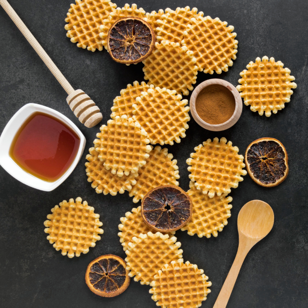

Nó là 2 miếng bánh được kẹp với siro ở giữa. Nguồn gốc của chiếc bánh Stroopwafels này được một người thợ làm bánh tận dụng những mẫu bánh thừa và kết dính chúng lại bằng siro caramel, ăn vừa giòn, vừa dẻo.

Và Như các bạn đã thấy, cookies – những mẩu bánh nhỏ len lỏi trong cuộc sống của chúng ta – cũng như magic cookie; sau này, được vay mượn trong web cookie trở thành những mẩu dữ liệu được lưu trữ và chuyển phát trong suốt quá trình thực thi website.

Nên vì vậy, Cheers to cookies and a Happy New Year!

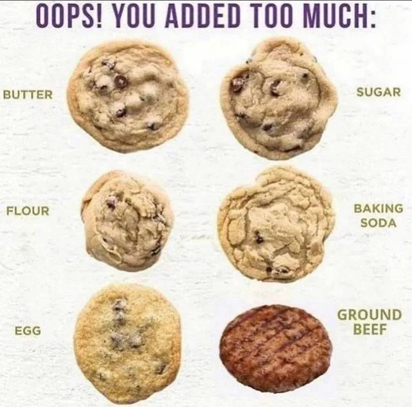

p/s: Nhân tiện thì mình có vô tình biết đến một tiệm bánh, có bán cookies rất ngon ở Sài Gòn

https://www.facebook.com/profile.php?id=100085904235991
